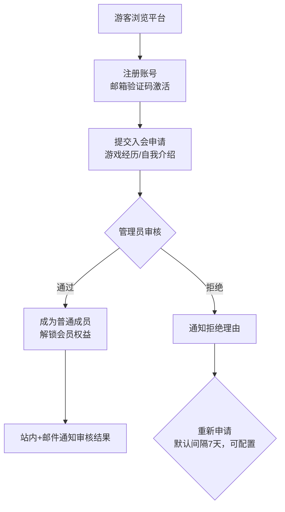
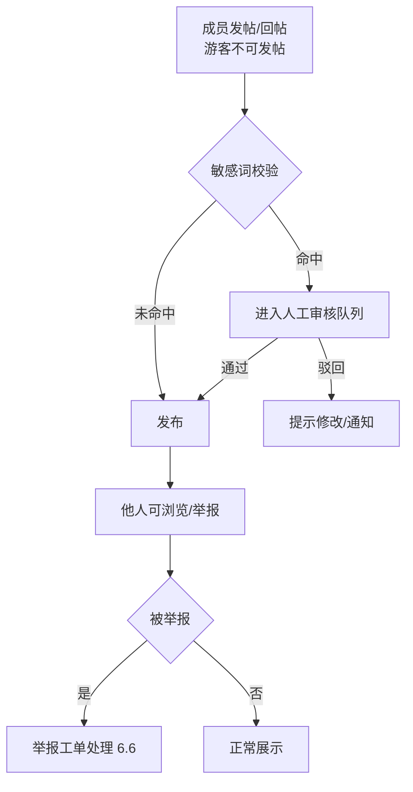
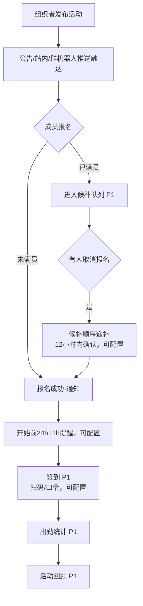
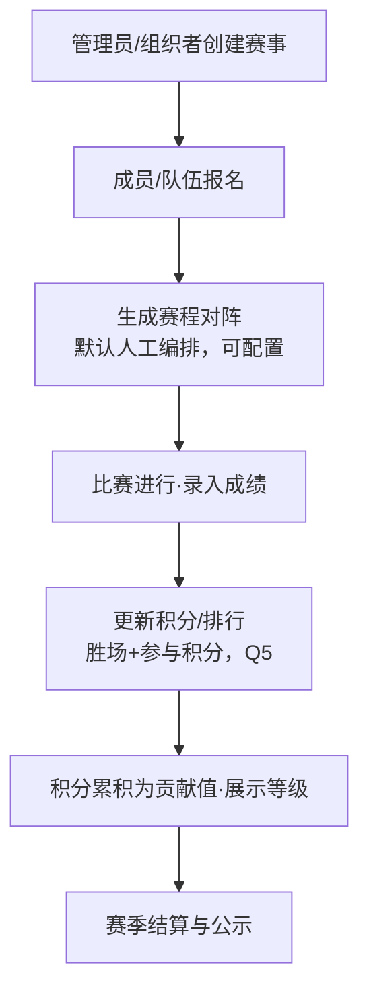
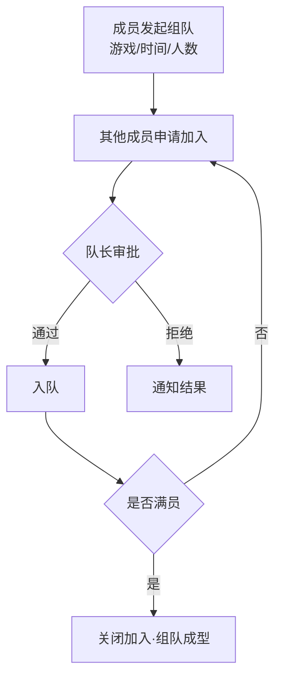
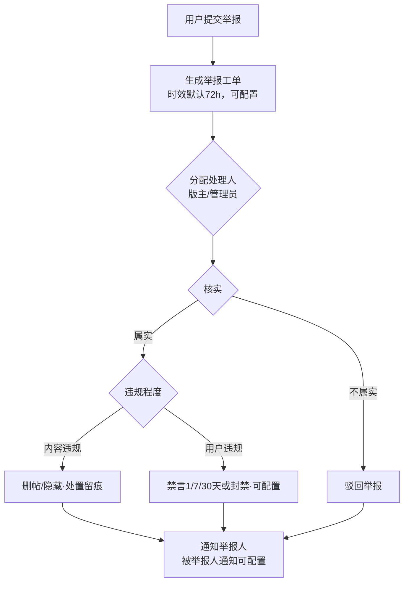

# 吉悠社成员中心 产品需求文档（PRD）

| 项目 | 内容 |
| --- | --- |
| 文档版本 | v1.1（已定稿，人工评审通过 2026-10-01） |
| 产品名称 | 吉悠社成员中心（Web 平台） |
| 文档状态 | 待确认项已全部闭环；v1.1 变更（等级与经验值系统）已回填并评审通过；v1.2 等级系统扩展（Lv1–20）已回填（2026-10-07） |
| 关联文档 | 《待确认问题清单》（`docs/待确认问题清单.md`，全部 8 项已于 2026-09-30 确认闭环）、《软件需求规格说明书（SRS）》（`docs/SRS-吉悠社成员中心.md`，v1.0 已定稿 2026-10-01） |
| 更新日期 | 2026-10-01 |

---

## 1. 文档说明

### 1.1 文档目的
定义"吉悠社成员中心"Web 平台的产品需求，作为产品设计、研发排期、测试验收的统一依据。

### 1.2 读者对象
产品/设计、前后端研发、测试、社群运营与管理员。

### 1.3 编写与确认规则
- 本文档所有业务规则均来自与吉悠社运营方的三轮需求澄清与两批待确认问题确认（2026-09-30），**未经确认的业务规则一律不落入本文档**。
- 原 8 项待确认问题（Q1–Q8）已全部逐条确认并回填本文档，确认结论见《待确认问题清单》"确认记录"。

### 1.4 术语表

| 术语 | 定义 |
| --- | --- |
| 游客 | 未注册或未登录的访问者，仅可浏览公开内容（不可发帖/回帖/互动） |
| 普通成员 | 注册并通过入会申请审核的用户 |
| 版主 | 由管理员指定的、负责某一/多个版块内容管理的成员 |
| 活动组织者 | 由管理员授权、可创建与管理活动的成员（可与版主兼任） |
| 管理员 | 社群运营方人员，拥有平台全部管理权限 |
| 会员权益 | 普通成员相对游客解锁的能力（发帖互动、活动报名、专属版块等） |
| P0/P1/P2 | 功能优先级：P0=首发必须；P1=首发完整体验；P2=后续迭代增值 |
| 运营参数 | 数值型业务规则（时限/上限/档位等），默认值见各条，全部支持后台配置（7.1 R9） |

### 1.5 版本记录

| 版本 | 日期 | 说明 |
| --- | --- | --- |
| v0.9 | 2026-09-30 | 基于三轮需求澄清完成初稿 |
| v1.0 | 2026-09-30 | Q1–Q8 全部确认闭环，结论回填全文，定稿待人工评审 |
| v1.1 | 2026-09-30 | 回填等级与经验值系统变更（需求方 2026-09-30 确认）：C5 改写、新增 C6–C8、D5 补充活动奖励发放、F1 补充变动通知、R10 更新、优先级调整 |
| v1.2 | 2026-10-07 | 等级系统扩展（需求方原型走查确认）：C7 档位表由 5 档扩展为 20 级/5 大段位，升级所需经验随等级递增；段位框展示规范同步（SRS FR-G2 已更新） |

---

## 2. 业务背景与目标

### 2.1 社群概况
吉悠社是一个**综合游戏兴趣社群**：不限定单一游戏，覆盖多款电子游戏，同时包含桌游与线下聚会活动，长期运营。**社群成员均为成年人**（Q1 确认）。

### 2.2 现状与核心痛点
社群当前主要依靠聊天群（QQ/微信群）组织，存在三类核心痛点：

| # | 痛点 | 表现 | 平台对应解法 |
| --- | --- | --- | --- |
| P1 | 活动组织混乱 | 活动通知散落在群聊、报名靠接龙、无人记录出勤 | 活动模块：统一发布→报名→签到→出勤统计（5.4） |
| P2 | 内容无法沉淀 | 讨论散落在聊天群，难以检索与沉淀 | 论坛模块：多版块、搜索、精华沉淀（5.2） |
| P3 | 成员管理缺失 | 成员身份、权限、贡献无统一管理工具 | 成员模块 + 后台成员管理（5.3/5.5） |

### 2.3 产品定位
面向吉悠社的**长期 Web 平台**，具备基础的论坛功能、活动组织和后台管理能力；对外公开以吸引新成员注册加入，**获客是重要目标**。

### 2.4 业务目标与成功指标
平台上线后围绕三类指标衡量（**指标口径与埋点定义见第 9 章；目标值不在本 PRD 中预设，由运营方上线后依据基线数据制定并按季度校准**——Q3 确认）：

1. **活跃度指标**：DAU/MAU、周活跃率、发帖量等；
2. **活动参与指标**：活动报名率、活动出席率等；
3. **成员增长指标**：注册转化率、入会申请通过率、游客→成员转化率等。

---

## 3. 用户角色与权限矩阵

### 3.1 角色体系
采用**四级角色体系**：游客 → 普通成员 → 版主 / 活动组织者 → 管理员，权限逐级叠加。版主与活动组织者为平级的专业分工角色，可由同一成员兼任。

### 3.2 权限矩阵

图例：✔ 允许｜✘ 不允许

| 功能 | 游客 | 普通成员 | 版主 | 活动组织者 | 管理员 |
| --- | :-: | :-: | :-: | :-: | :-: |
| 浏览公开版块/帖子 | ✔ | ✔ | ✔ | ✔ | ✔ |
| 浏览成员专属版块 | ✘ | ✔ | ✔ | ✔ | ✔ |
| 浏览成员列表与标签 | ✔ | ✔ | ✔ | ✔ | ✔ |
| 发帖（公开/专属版块） | ✘（Q7：游客仅可浏览） | ✔ | ✔ | ✔ | ✔ |
| 回帖/点赞/收藏 | ✘（同上） | ✔ | ✔ | ✔ | ✔ |
| @提及/上传图片附件 | ✘ | ✔ | ✔ | ✔ | ✔ |
| 帖子置顶/加精（本版块） | ✘ | ✘ | ✔ | ✘ | ✔ |
| 删除/隐藏违规帖（本版块） | ✘ | ✘ | ✔ | ✘ | ✔ |
| 处理本版块举报 | ✘ | ✘ | ✔ | ✘ | ✔ |
| 创建/编辑活动 | ✘ | ✘ | ✘ | ✔ | ✔ |
| 活动签到核销/出勤记录 | ✘ | ✘ | ✘ | ✔ | ✔ |
| 报名名单导出 | ✘ | ✘ | ✘ | ✔ | ✔ |
| 入会申请审核 | ✘ | ✘ | ✘ | ✘ | ✔ |
| 禁言/封禁 | ✘ | ✘ | ✘ | ✘ | ✔ |
| 角色分配（版主/活动组织者） | ✘ | ✘ | ✘ | ✘ | ✔ |
| 版块管理（增删改、子版块、归属） | ✘ | ✘ | ✘ | ✘ | ✔ |
| 数据看板/系统配置/公告 | ✘ | ✘ | ✘ | ✘ | ✔ |
| 查看自己的报名与出勤 | ✘ | ✔ | ✔ | ✔ | ✔ |
| 申请加入社群 | ✔ | — | — | — | — |

### 3.3 角色规则
- 一名用户同一时刻仅一个"基础身份"（游客/普通成员），版主、活动组织者、管理员为其叠加的能力角色；
- 角色分配与回收仅由管理员执行，操作留痕（见 8.2）。

---

## 4. 核心用户旅程与业务场景

### 4.1 旅程一：游客拉新转化（获客主线）
游客通过分享链接进入平台 → 浏览公开版块、成员列表与活动日历 → 注册账号（邮箱验证码激活，Q2）→ 提交入会申请 → 管理员审核通过 → 成为普通成员，解锁发帖互动、活动报名、专属版块等权益。

**对应指标**：注册转化率、入会申请通过率、游客→成员转化率。

### 4.2 旅程二：成员日常活跃（留存主线）
成员登录 → 查看公告与关注版块新帖 → 浏览成员列表按兴趣标签找到同好 → 发帖/回帖互动 → 收到回复/@通知回访。

**对应指标**：DAU/MAU、周活跃率、发帖量。

### 4.3 旅程三：活动全周期（组织主线）
活动组织者发布活动（时间/地点/人数上限）→ 公告/站内/群机器人推送触达成员 → 成员报名（满员候补）→ 活动日签到 → 出勤统计与结果反馈。

**对应指标**：活动报名率、出席率。

### 4.4 旅程四：组队开黑与赛事（进阶场景）
成员发起组队 → 队员加入、队长管理 → 周期性赛事报名 → 赛程对阵 → 成绩录入 → 积分排行更新，积分兼作贡献值累积（Q5）。

**对应指标**：组队参与人次、赛事报名率。

### 4.5 旅程五：管理员运营与治理（保障主线）
管理员后台：入会审核 → 成员/角色管理 → 举报处理与违规处置（禁言/封禁）→ 数据看板监控 → 公告与敏感词库/运营参数配置。

**对应指标**：举报处理时长、违规处置量。

---

## 5. 功能模块清单（P0/P1/P2）

优先级判定原则：
- **P0**：支撑"游客浏览→注册入会→论坛互动→活动报名"最小业务闭环，缺一不可；
- **P1**：完整体验与运营效率（检索、日历、组队、看板等）；
- **P2**：增值与后续迭代能力。

### 5.1 账号与会员体系

| 编号 | 功能 | 优先级 | 说明 | 业务规则 |
| --- | --- | :-: | --- | --- |
| A1 | 注册登录（邮箱+密码） | P0 | 邮箱注册、登录、找回密码 | 邮箱唯一；**注册须邮箱验证码激活**，找回密码走邮箱（Q2）；短信不纳入范围 |
| A2 | 游客浏览公开内容 | P0 | 未登录可浏览公开版块、活动日历、成员列表 | 专属版块仅成员可见（3.2）；**游客仅可浏览，不可发帖/回帖/点赞/收藏**（Q7） |
| A3 | 成员发帖/互动权益 | P0 | 成员获得发帖、回帖、点赞、收藏能力 | 发帖/互动权限属会员权益，游客不开放（Q7） |
| A4 | 入会申请与审核 | P0 | 填写申请表（游戏经历/自我介绍）→管理员审核 | 审核通过即成为普通成员；拒绝需填写理由并通知；**被拒后可重新申请，默认间隔 7 天（运营参数，后台可配置）** |
| A5 | 会员分层权益 | P0 | 成员解锁：发帖互动、活动报名、专属版块、@提及、附件上传等 | 权益清单以 3.2 权限矩阵为准 |
| A6 | 个人主页与资料编辑 | P1 | 昵称、头像、游戏经历、自我介绍 | 头像合规（复用内容审核） |
| A7 | 账号注销 | P1 | 用户自助注销 | 注销设 30 天冷静期，期满后个人信息删除或匿名化（运营参数，可配置） |
| A8 | 第三方登录 | P2 | 微信/QQ OAuth | 首期不纳入，作为后续迭代选项 |

### 5.2 论坛模块

| 编号 | 功能 | 优先级 | 说明 | 业务规则 |
| --- | --- | :-: | --- | --- |
| B1 | 多版块结构与浏览 | P0 | **版块支持两级结构（版块→子版块，Q4）**、帖子列表分页 | 初始版块见 7.3；版块结构后台可随时增删改（Q4） |
| B2 | 发帖/编辑/删除 | P0 | 发布主题帖、编辑、作者自删 | **内容编辑后重新过敏感词校验，命中则转人工审核，未命中直接生效**（Q7） |
| B3 | 回帖 | P0 | 按时间序展示回帖 | 仅登录成员可回帖（Q7） |
| B4 | 点赞/收藏 | P0 | 帖子与回帖点赞；帖子收藏 | 同一用户对同一对象仅一次有效点赞 |
| B5 | 敏感词过滤 | P0 | 发帖/回帖/资料发布时校验 | **采用"先发后审+敏感词拦截"：未命中直接发布，命中转人工审核队列**（Q7）；词库后台可维护（E10） |
| B6 | 举报 | P0 | 对帖子/回帖/用户举报 | 举报理由枚举（垃圾广告/人身攻击/违规内容/其他，可配置）+ 补充说明；流转见 6.6 |
| B7 | 楼层回复（引用回复） | P1 | 回帖可针对某一楼层 | 楼层号全局唯一显示 |
| B8 | @提及 | P1 | 帖子/回帖中@成员，触发站内通知 | 仅可@普通成员及以上；游客不可被@ |
| B9 | 富文本编辑与图片附件 | P1 | 富文本、图片上传 | 图片默认 ≤10MB，格式 jpg/png/gif/webp（运营参数，可配置）；附件经内容安全校验 |
| B10 | 搜索 | P1 | 按标题/正文关键词搜帖，按版块/时间过滤 | **默认覆盖标题+正文+回帖内容**（运营参数，可配置） |
| B11 | 热门排序 | P1 | 版块列表支持最新/热门排序 | 热门默认按"点赞×2+回帖×1"加权、统计近 7 天（运营参数，可配置） |
| B12 | 置顶/加精 | P1 | 版主对本版块、管理员对全站 | 每版块默认置顶上限 5 条（运营参数，可配置）；加精进入"精华区" |
| B13 | 回帖/回复通知 | P1 | 被回帖、被@、被点赞时站内通知 | 同类通知默认 1 小时内聚合为一条（运营参数，可配置） |
| B14 | 视频附件 | P2 | 帖子附短视频 | 默认 ≤200MB/≤5 分钟（运营参数，可配置） |
| B15 | 草稿箱 | P2 | 帖子草稿保存 | — |

### 5.3 成员模块

| 编号 | 功能 | 优先级 | 说明 | 业务规则 |
| --- | --- | :-: | --- | --- |
| C1 | 成员列表 | P0 | 全体成员分页浏览 | 游客可见（3.2）；展示昵称/头像/标签 |
| C2 | 兴趣标签发现 | P0 | 成员设置兴趣标签（游戏/桌游等），按标签筛选成员、标签聚合展示 | **预设标签库（后台可维护）+ 自定义标签（需过敏感词校验）** |
| C3 | 个人主页 | P1 | 展示资料、标签、发帖/回帖、报名与出勤记录 | 出勤记录默认对全员可见（运营参数，可关闭） |
| C4 | 关注/好友 | P2 | 关注成员、动态聚合 | — |
| C5 | 贡献值展示 | P1 | 贡献值由赛事积分与管理员赠送积分累积，在个人主页展示 | **v1.1 变更（2026-09-30 需求方确认）：等级改由经验值决定（C7）；贡献值仅作荣誉展示、不决定等级、不解锁任何权限** |
| C6 | 每日签到 | P1 | 成员每日在平台签到一次，获得经验值（v1.1 新增） | 每自然日限一次；连续签到按 7 天周期递增（默认 +10/+12/+14/+16/+18/+20/+30，R9 可配置）；支持补签卡补签（获取方式待确认） |
| C7 | 经验值与等级 | P1 | 经验值累积决定等级；获取渠道：每日签到、活动结束按出勤统一发放奖励、管理员赠送（v1.1 新增） | 等级仅荣誉展示，不解锁任何权限；活动结束后按出勤记录对出席者统一发放经验值+积分（默认 +50 经验 +20 积分）；等级默认 20 级，分 5 大段位：见习 Lv1–4 / 常驻 Lv5–8 / 活跃 Lv9–12 / 元老 Lv13–16 / 传奇 Lv17–20；升级所需经验随等级递增——Lv n→n+1 需 100×n 经验（累计 50×n(n−1)，Lv20 需 19,000）；展示为「段位框」（数字色块+段位名），个人主页/签到页附升级进度（v1.2 增补 2026-10-07）；均可后台配置（R9） |
| C8 | 管理员赠送经验值/积分 | P1 | 管理员向指定成员赠送经验值和/或积分，赠送后站内通知成员（v1.1 新增） | 仅管理员可操作；操作留痕（R8/E11）；单次赠送上限默认 1000（R9 可配置） |

### 5.4 活动模块

| 编号 | 功能 | 优先级 | 说明 | 业务规则 |
| --- | --- | :-: | --- | --- |
| D1 | 活动发布/编辑/取消 | P0 | 组织者发布：标题、类型（线上/线下）、时间、地点、人数上限、说明 | **活动开始前默认 2 小时停止编辑**（运营参数，可配置）；取消须通知已报名/候补成员 |
| D2 | 活动报名/取消报名 | P0 | 成员报名，满员后不可报 | **报名截止默认为活动开始前 2 小时**（运营参数，可配置）；人数上限由活动自定义 |
| D3 | 候补队列 | P1 | 满员后可进入候补，有名额释放按顺序递补 | **递补通知后默认 12 小时内确认，超时顺延下一位**（运营参数，可配置） |
| D4 | 活动日历视图 | P1 | 按月查看活动分布，一键跳转详情 | — |
| D5 | 活动签到 | P1 | 线下活动组织者核销签到；线上活动标记参与 | **默认签到方式：扫码签到，支持口令签到备选**（运营参数，可配置）；**v1.1 变更：活动结束后按出勤（签到）记录对出席者统一发放奖励（经验值+积分），默认 +50 经验 +20 积分，后台可配置（R9）** |
| D6 | 出勤统计 | P1 | 按成员统计报名数/出席数/出席率 | 数据用于个人主页（C3）与看板（E9） |
| D7 | 活动结果反馈 | P1 | 活动结束后组织者发布回顾（图文） | — |
| D8 | 组队/开黑 | P1 | 成员发起组队帖：游戏、时间、人数、队伍成员加入/退出，队长管理 | 队长=发起者或转让；满员自动关闭加入 |
| D9 | 赛事与积分 | P2 | 周期性赛事：报名、赛程/对阵、成绩录入、积分排行 | **积分=胜场积分+参与积分；积分兼作贡献值累积、展示等级但不解锁权限；赛程对阵默认人工编排**（运营参数，可配置）（Q5） |
| D10 | 活动提醒 | P1 | 活动开始前定时提醒报名者（站内/邮件） | **默认提前 24 小时+1 小时各提醒一次**（运营参数，可配置） |

### 5.5 后台管理模块

| 编号 | 功能 | 优先级 | 说明 | 业务规则 |
| --- | --- | :-: | --- | --- |
| E1 | 入会申请审核 | P0 | 申请列表、通过/拒绝（填理由）、记录留痕 | 重新申请间隔见 A4 |
| E2 | 成员管理 | P0 | 成员列表查询、资料查看、状态管理 | 处置操作留痕 |
| E3 | 禁言/封禁 | P0 | 对违规成员禁言（禁止发帖回帖）或封禁（禁止登录） | **禁言档位默认 1/7/30 天（可配置），封禁默认永久（可配置）**；**被处置用户既有内容默认保留，违规内容由处置人单独删除** |
| E4 | 角色分配 | P0 | 指定/取消版主、活动组织者 | 仅管理员可操作；留痕 |
| E5 | 帖子管理 | P0 | 按版块/状态筛选，删除/隐藏帖子与回帖 | **删除后默认保留"该内容已被删除"占位**（运营参数，可配置） |
| E6 | 举报处理 | P0 | 举报工单流转：受理→处置→反馈举报人 | **处理时效默认 72 小时**（运营参数，可配置）；**处置结果通知举报人，是否通知被举报人可配置（默认不通知）**；处置留痕 |
| E7 | 版块管理 | P1 | 版块增删改、排序、公开/成员专属设置、**两级子版块管理**（Q4） | 删除版块需先迁移或归档帖子 |
| E8 | 活动管理 | P1 | 全部活动列表、代创建/编辑/取消、报名名单导出（CSV） | — |
| E9 | 数据看板 | P1 | 第 9 章指标的图表展示，支持按时间筛选 | — |
| E10 | 系统配置与运营参数 | P1 | 敏感词库维护、通知开关、公告发布、**全部运营参数的集中配置（见 7.1 R9）** | 敏感词增删即时生效；运营参数修改留痕 |
| E11 | 操作审计日志 | P1 | 后台全部敏感操作留痕（谁/何时/做了什么） | **默认保存 ≥1 年**（运营参数，可配置） |

### 5.6 通知模块

| 编号 | 功能 | 优先级 | 说明 | 业务规则 |
| --- | --- | :-: | --- | --- |
| F1 | 站内通知中心 | P0 | 消息列表、已读/未读、未读角标 | 覆盖：回复/@/点赞/审核结果/报名结果/活动提醒/**经验值与积分变动（含管理员赠送，v1.1 变更）** |
| F2 | 邮件通知 | P1 | 入会审核结果、活动提醒等发送邮件 | 用户可关闭邮件订阅 |
| F3 | 群机器人推送 | P2 | 活动/公告推送到吉悠社主群 | **选型已确认：QQ 群官方机器人 API**（Q6）；开发启动前完成机器人资质与接入申请 |
| F4 | 短信通知 | 不纳入 | 已确认不纳入范围（Q2） | — |

### 5.7 优先级汇总

- **P0（首发必须）**：A1–A5、B1–B6、C1–C2、D1–D2、E1–E6、F1；
- **P1（首发完整体验）**：A6–A7、B7–B13、C3、**C5–C8（v1.1 变更，原 C5 为 P2）**、D3–D8、D10、E7–E11、F2；
- **P2（后续迭代）**：A8、B14–B15、C4、D9、F3。

---

## 6. 核心业务流程

### 6.1 入会审核流程（P0）

### 6.2 发帖与内容安全流程（P0）

> 说明：内容编辑后重新执行敏感词校验（B2）。游客不可发帖/回帖（Q7），故无游客内容审核分支。

### 6.3 活动报名与候补流程（P0/P1）

### 6.4 赛事与积分流程（P2）

### 6.5 组队开黑流程（P1）

### 6.6 举报与违规处置流程（P0）

---

## 7. 业务规则与边界约束

### 7.1 已确认的核心业务规则

| 编号 | 规则 |
| --- | --- |
| R1 | 角色权限逐级叠加：版主/活动组织者/管理员能力可由同一成员兼任；角色仅管理员可分配（3.3） |
| R2 | 会员分层：**游客仅可浏览公开内容，发帖/回帖/点赞/收藏/活动报名/专属版块/@提及/附件上传为成员权益**（Q7 确认） |
| R3 | 入会申请须管理员审核通过方可成为普通成员；被拒后可重新申请（默认间隔 7 天，可配置）（A4） |
| R4 | 论坛内容采用"先发后审+敏感词拦截"：未命中直接发布，命中转人工审核；编辑后重新校验（B5/B2，Q7） |
| R5 | 活动报名满员后进入候补队列，名额释放按顺序递补（D3） |
| R6 | 活动取消须通知所有已报名/候补成员（D1） |
| R7 | 组队满员自动关闭加入，队长为发起者或受让者（D8） |
| R8 | 后台所有敏感操作（审核、删帖、禁言、封禁、角色变更、配置修改）必须留痕（E11） |
| R9 | **数值型运营参数（时限/上限/档位/权重/开关）全部支持后台配置，文档标注值仅为上线初始默认值**（Q8 确认） |
| R10 | **v1.1 变更（2026-09-30 需求方确认）**：赛事积分累积为贡献值仅展示、不解锁任何权限；等级由经验值决定（获取渠道：每日签到、活动出席奖励、管理员赠送），等级同样不解锁任何权限（原 Q5 口径"积分兼作贡献值并决定等级"作废） |

### 7.2 边界约束（Out of Scope）

| 编号 | 明确不做 | 备注 |
| --- | --- | --- |
| X1 | 短信通知/短信验证码 | 已确认不纳入（Q2） |
| X2 | App 原生客户端 | 仅 Web（响应式适配移动端浏览器） |
| X3 | 支付/会员付费、商城 | 首期不涉及 |
| X4 | 即时聊天（IM 私聊） | 站内通知不含点对点聊天 |
| X5 | 未成年人保护专项策略 | **已确认：社群成员均为成年，不纳入**（Q1） |
| X6 | 第三方登录 | 首期不纳入，列为 P2 迭代选项（A8） |

### 7.3 初始版块规划（Q4）

版块支持两级结构，以下为上线初始建议清单，**后台可随时增删改、调整公开/专属属性**（Q4 确认）：

| 版块 | 子版块 | 属性 |
| --- | --- | --- |
| 公告栏 | 社务公告 / 活动公示 | 成员专属 |
| 综合闲聊 | —（可直接发帖） | 公开 |
| 游戏分区 | 按社群主要游戏增设子版块（后台按需创建） | 公开 |
| 桌游面杀 | — | 公开 |
| 线下活动 | — | 公开 |
| 求助问答 | — | 公开 |

---

## 8. 非功能性需求（NFR）

### 8.1 性能

| 编号 | 需求 | 指标 |
| --- | --- | --- |
| NF1 | 页面加载 | 首屏加载 ≤ 3s（常规宽带）；核心接口 P95 响应 ≤ 500ms |
| NF2 | 并发能力 | 按成员规模 ≤5000、峰值在线 ≤500 做初始估算设计（运营参数，上线后压测校准） |
| NF3 | 附件上传 | 图片默认 ≤10MB（可配置），支持进度显示与失败重试 |
| NF4 | 可用性 | 年度可用性 ≥ 99%；重要操作失败有明确错误提示 |

### 8.2 安全

| 编号 | 需求 | 说明 |
| --- | --- | --- |
| NF5 | 密码安全 | 密码加盐哈希存储（禁止明文/可逆加密），密码强度校验 |
| NF6 | 登录防护 | 登录图形验证码+频率限制防撞库；**连续失败默认 5 次锁定 15 分钟**（运营参数，可配置） |
| NF7 | 后台二次验证 | 管理后台登录二次验证：**默认邮箱验证码**（复用邮件通道，可升级 TOTP，运营参数） |
| NF8 | 传输安全 | 全站 HTTPS |
| NF9 | 权限控制 | 服务端逐接口鉴权，前后端双重校验；越权访问返回明确错误 |
| NF10 | 常见漏洞防护 | OWASP Top 10：SQL 注入、XSS（富文本白名单过滤）、CSRF、越权 |

### 8.3 合规

| 编号 | 需求 | 说明 |
| --- | --- | --- |
| NF11 | 个人信息保护 | 隐私政策与收集最小化：仅收集邮箱、昵称及必要社群资料；注册时明示并取得同意 |
| NF12 | 账号注销 | 自助注销+30 天冷静期，期满后个人信息删除或匿名化（细则运营参数，可配置） |
| NF13 | 内容安全合规 | 具备内容审核能力（敏感词+人工举报处置）、举报渠道、违规处置留痕 |
| NF14 | 操作留痕 | 后台敏感操作与违规处置记录可追溯（E11） |
| NF15 | 备案与部署合规 | **域名注册、服务器与 ICP 备案由吉悠社运营方（平台运营主体）负责**；上线前完成备案核查 |

---

## 9. 数据指标定义

> 依据 Q3 确认：本 PRD 只定义指标口径与采集点，**不预设目标值**；目标值由运营方上线后按基线数据制定并按季度校准。

### 9.1 活跃度指标

| 指标 | 口径定义 | 采集点 |
| --- | --- | --- |
| DAU | 当日发生登录或任一核心行为（浏览/发帖/回帖/报名）的去重用户数 | 登录与行为埋点 |
| MAU | 当月去重活跃用户数 | 同上 |
| DAU/MAU 粘性 | DAU 月均值 ÷ 当月 MAU | 派生 |
| 周活跃率 | 周活跃用户数 ÷ 普通成员总数 | 派生 |
| 日发帖量 | 当日新发布主题帖数 | 发帖埋点 |
| 日互动量 | 当日回帖+点赞+收藏次数合计 | 互动埋点 |

### 9.2 活动参与指标

| 指标 | 口径定义 | 采集点 |
| --- | --- | --- |
| 活动报名率 | 当期活动报名人次 ÷ 当期活跃成员数 | 报名埋点 |
| 活动出席率 | 签到人数 ÷ 有效报名人数（扣除活动前取消） | 签到埋点 |
| 候补转化率 | 候补递补成功人数 ÷ 候补总人数 | 候补埋点 |
| 活动举办数 | 当期状态为"已举办"的活动数 | 活动状态 |
| 组队参与人次 | 当期加入组队的总人次 | 组队埋点 |

### 9.3 成员增长指标

| 指标 | 口径定义 | 采集点 |
| --- | --- | --- |
| 注册转化率 | 完成注册的访客数 ÷ 平台 UV（去重访客） | 注册埋点 |
| 入会申请量 | 当期提交入会申请数 | 申请埋点 |
| 入会通过率 | 审核通过数 ÷ 审核完成数 | 审核记录 |
| 游客→成员转化率 | 新晋普通成员数 ÷ 同期新注册用户数 | 派生 |
| 渠道来源分布 | 按落地页来源（分享链接/群机器人推送/直接访问）拆分 UV | 渠道参数埋点 |

### 9.4 治理类指标

| 指标 | 口径定义 | 采集点 |
| --- | --- | --- |
| 举报处理时长 | 举报工单从提交到处置完成的平均时长 | 工单时间戳 |
| 违规处置量 | 当期删帖/禁言/封禁次数 | 后台留痕 |
| 敏感词拦截量 | 当期被敏感词校验转审核的内容数 | 内容校验埋点 |

---

## 10. 发布计划与里程碑

团队为完整配置（后端/前端/设计分工），按"一次成型"规划，优先级仍按 P0→P1→P2 分层交付以保证质量：

| 阶段 | 内容 | 里程碑 |
| --- | --- | --- |
| M1 需求与设计 | PRD 人工评审定稿、交互与视觉设计、QQ 群机器人资质申请（F3 前置） | 设计定稿 |
| M2 核心开发（P0） | 账号会员、论坛基础、成员列表/标签、活动发布报名、后台基础、站内通知 | P0 功能完成 |
| M3 完整开发（P1） | 论坛进阶与检索、日历/候补/签到/出勤、组队、后台看板/版块管理/运营参数配置、邮件通知 | 全功能完成 |
| M4 集成测试与安全 | 全量回归、性能压测（NF1–NF4）、安全测试（NF5–NF10）、合规检查（NF11–NF15） | 验收通过 |
| M5 上线与后续（P2） | 上线发布（含初始版块与敏感词库配置）、运营培训；P2 功能（赛事积分、QQ 群机器人等）进入迭代排期 | 平台上线 |

具体排期时间与人力配置由项目方按里程碑自行制定。

---

## 11. 附录

### 11.1 待确认问题闭环状态
原 8 项待确认问题（Q1–Q8）已全部于 2026-09-30 与运营方逐条确认并回填本文档，闭环结论详见《待确认问题清单》"确认记录"。本文档中不再保留未确认标记。

### 11.2 人工评审要点
1. 第 5 章功能清单完整性（对照三轮澄清结论逐项核对）；
2. 优先级划分是否符合"完整团队一次成型"的交付预期；
3. 第 7 章业务规则与 7.3 初始版块规划是否与社群实际运营口径一致；
4. 第 9 章指标口径是否可落地埋点；
5. R9 运营参数初始默认值是否合理（上线后可后台调整）。

### 11.3 变更记录

| 版本 | 日期 | 变更内容 | 变更人 |
| --- | --- | --- | --- |
| v0.9 | 2026-09-30 | 初稿（评审稿） | 产品 |
| v1.0 | 2026-09-30 | Q1–Q8 闭环回填：游客仅浏览（Q7）、邮箱验证码激活（Q2）、版块两级结构（Q4）、指标不定目标值（Q3）、积分兼作贡献值（Q5）、QQ 群机器人选型（Q6）、未成年人保护不纳入（Q1）、运营参数全部后台可配置（Q8/R9） | 产品 |
| v1.1 | 2026-09-30 | 等级与经验值系统变更（需求方确认，SRS 同步展开见 `docs/SRS-吉悠社成员中心.md` 3.7 节）：等级改由经验值决定（C5 改写、R10 更新）；新增每日签到（C6）、经验值与等级（C7）、管理员赠送经验值/积分（C8）；活动结束后按出勤统一发放奖励（D5）；站内通知补充经验值/积分变动（F1）；上述项优先级计入 P1 | 产品/需求方 |
| v1.2 | 2026-10-07 | 等级系统扩展（需求方原型走查确认）：C7 档位 20 级/5 大段位（见习/常驻/活跃/元老/传奇各 4 级），升级经验递增曲线（Lv n→n+1 需 100×n）；段位框展示规范（楼层带段位名、个人主页升级进度）；SRS FR-G2 同步展开 | 产品/需求方 |
