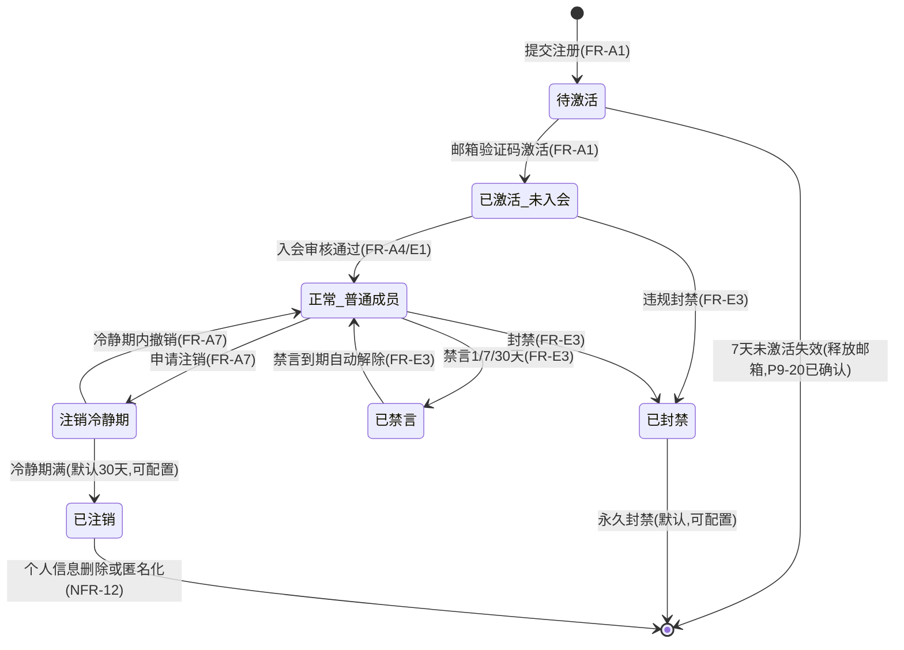
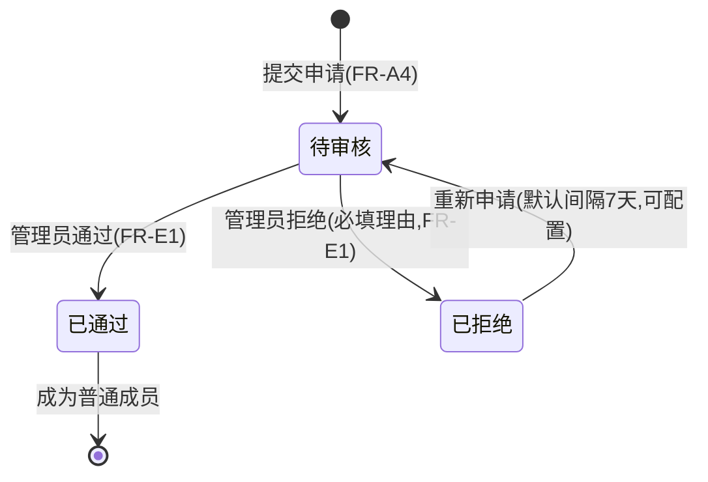
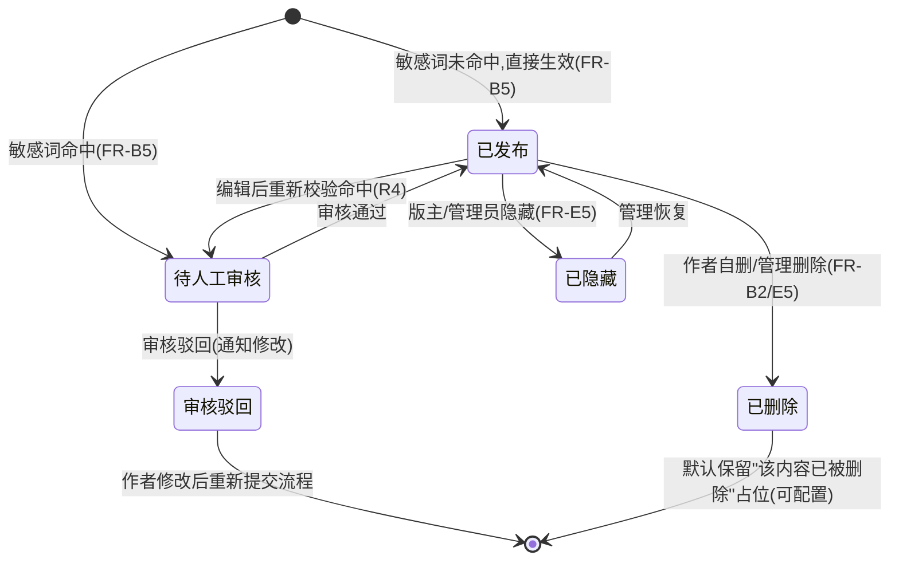
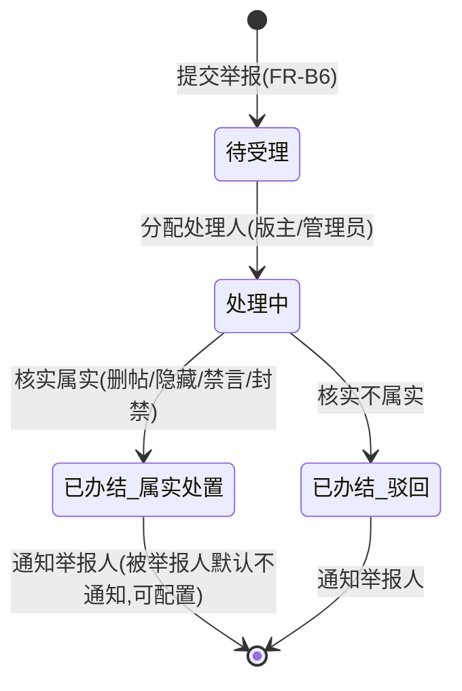
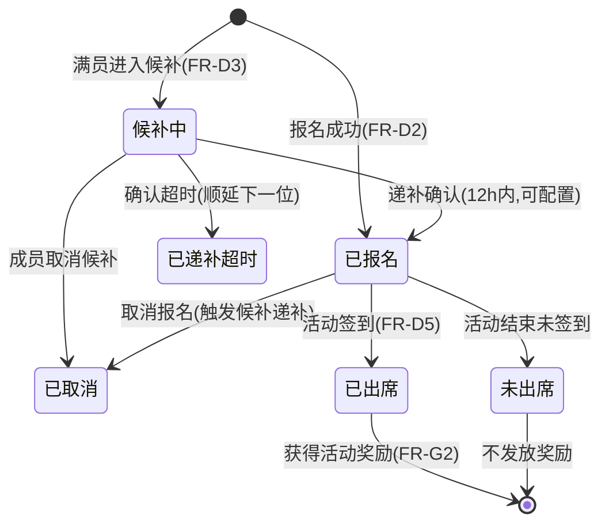
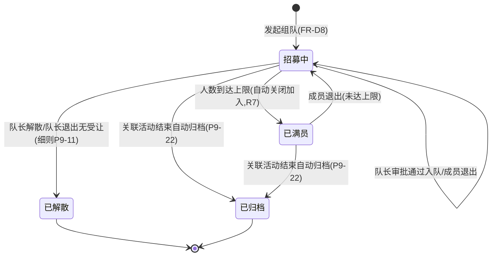
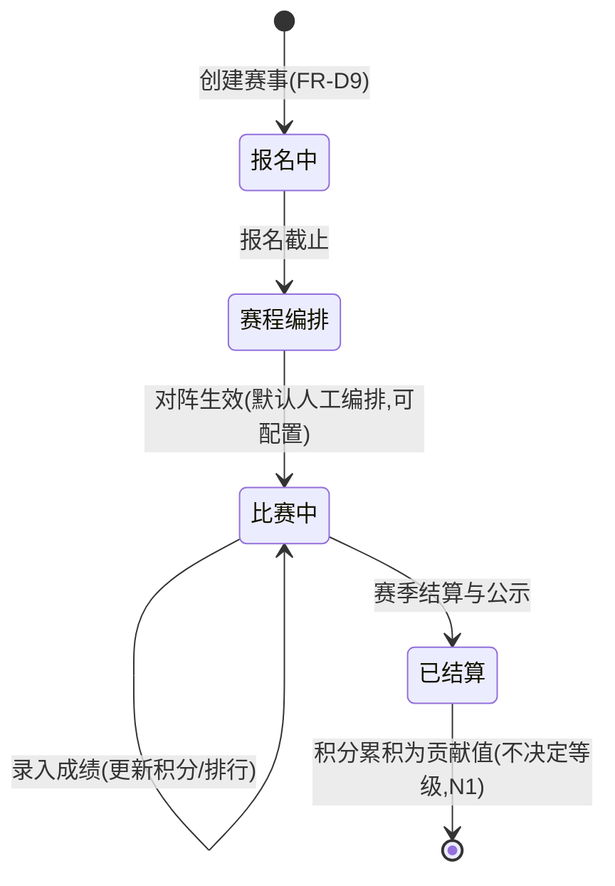
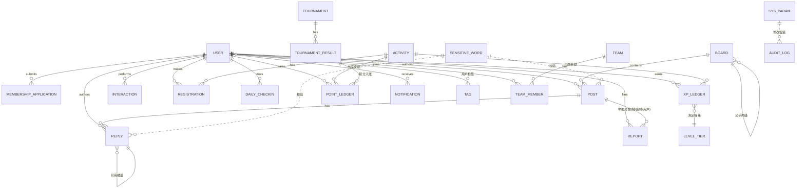

# 吉悠社成员中心 软件需求规格说明书（SRS）

| 项目 | 内容 |
| --- | --- |
| 文档版本 | v1.0（已定稿，人工评审通过） |
| 产品名称 | 吉悠社成员中心（Web 平台） |
| 需求来源 | 《PRD-吉悠社成员中心》v1.1（Q1–Q8 已闭环 + 等级与经验值系统变更已回填）+ 需求方 2026-09-30 变更确认 |
| 关联文档 | `docs/PRD-吉悠社成员中心.md`、`docs/待确认问题清单.md`、`docs/SRS-人工评审要点.md` |
| 更新日期 | 2026-10-01 |

---

## 1. 引言

### 1.1 编写目的
将 PRD 功能清单逐条展开为可设计、可开发、可测试的软件需求，定义非功能需求、角色权限、核心对象状态机与概念数据模型，作为概要设计、详细设计、开发与测试验收的统一依据。

### 1.2 范围
覆盖《PRD-吉悠社成员中心》v1.0 第 5 章全部 53 条功能（A1–A8、B1–B15、C1–C5、D1–D10、E1–E11、F1–F4），以及需求方 2026-09-30 确认的新增"等级与经验值系统"（FR-G1–FR-G3，共 3 条）。PRD 7.2 明确的范围外项（X1–X6）与本 SRS 第 9 章待确认项均不计入需求范围。

### 1.3 与 PRD 的关系及变更来源说明
- 本文档严格对齐 PRD v1.0：仅对 PRD 已确认内容做需求工程层面的细化（输入、输出、异常分支），**不新增业务规则**；
- 等级与经验值系统（3.7 节）为需求方 2026-09-30 口头确认的变更：等级改由经验值决定（变更 PRD C5/Q5 口径），新增每日签到、活动结束统一发放奖励、管理员赠送经验值/积分。该部分在 PRD 中标注为 **PRD v1.1 待回写项**，PRD 回写完成后其追溯来源更新为 PRD v1.1 对应章节；
- PRD 未定义的内容一律列入第 9 章待确认清单上报，本文档不自行扩展。

### 1.4 读者对象
产品/设计、前后端研发、测试、社群运营与管理员。

### 1.5 术语表

| 术语 | 定义 |
| --- | --- |
| 游客 | 未注册或未登录的访问者，仅可浏览公开内容 |
| 普通成员 | 注册并通过入会申请审核的用户 |
| 版主 | 由管理员指定的、负责某一/多个版块内容管理的成员 |
| 活动组织者 | 由管理员授权、可创建与管理活动的成员（可与版主兼任） |
| 管理员 | 社群运营方人员，拥有平台全部管理权限 |
| 运营参数 | 数值型业务规则（时限/上限/档位等），全部支持后台配置（R9），文中标注值仅为上线初始默认值 |
| 经验值 | 决定成员等级的累积数值，通过每日签到、活动奖励、管理员赠送获得 |
| 贡献值 | 由赛事积分累积的展示性数值，不决定等级 |
| 签到（活动） | 线下活动现场核销出席（PRD D5），与"每日签到"为不同概念 |
| 签到（每日） | 成员在平台每日一次的签到行为，获得经验值（本 SRS 新增功能 FR-G1） |
| P0/P1/P2 | 功能优先级：P0=首发必须；P1=首发完整体验；P2=后续迭代增值 |

### 1.6 需求编号与可追溯性规则
- 功能需求编号：`FR-<模块字母><序号>`（如 FR-A1），与 PRD 功能编号一一对应；
- 非功能需求编号：`NFR-x`，映射 PRD 第 8 章 NF1–NF15；
- 每条需求头部标注来源章节（如 `← PRD 5.1 A1`）及关联确认项（如 Q2、R9）；
- G 模块（等级与经验值）标注来源为"需求方 2026-09-30 变更确认"，PRD v1.1 回写后对应 C6–C8；
- 完整双向追溯见第 8 章。

### 1.7 版本记录

| 版本 | 日期 | 说明 |
| --- | --- | --- |
| v1.0 | 2026-09-30 | 基于 PRD v1.0 + 需求方变更确认（等级与经验值系统）编写初稿 |
| v1.0 | 2026-10-01 | **人工评审通过，定稿**。第 9 章待确认项（P9-01～P9-23）按清单逐项确认后回填 |

---

## 2. 总体描述

### 2.1 产品定位
面向吉悠社（综合游戏兴趣社群，成员均为成年人）的长期 Web 平台，具备论坛、活动组织、成员管理与后台治理能力；对外公开以吸引新成员注册加入。

### 2.2 角色体系
四级角色：游客 → 普通成员 → 版主 / 活动组织者 → 管理员，权限逐级叠加（← PRD 3.1、R1）。

- 规则 1：一名用户同一时刻仅一个"基础身份"（游客/普通成员）；版主、活动组织者、管理员为可叠加的能力角色，可兼任（← PRD 3.3）；
- 规则 2：角色分配与回收仅由管理员执行，操作留痕（← PRD 3.3、R8）。

### 2.3 角色-权限矩阵

图例：✔ 允许｜✘ 不允许｜— 不适用。来源：PRD 3.2 + 本 SRS 新增项（标 *）。

| 功能 | 游客 | 普通成员 | 版主 | 活动组织者 | 管理员 | 来源 |
| --- | :-: | :-: | :-: | :-: | :-: | --- |
| 浏览公开版块/帖子 | ✔ | ✔ | ✔ | ✔ | ✔ | PRD 3.2 |
| 浏览成员专属版块 | ✘ | ✔ | ✔ | ✔ | ✔ | PRD 3.2 |
| 浏览成员列表与标签 | ✔ | ✔ | ✔ | ✔ | ✔ | PRD 3.2 |
| 发帖（公开/专属版块） | ✘ | ✔ | ✔ | ✔ | ✔ | PRD 3.2（Q7） |
| 回帖/点赞/收藏 | ✘ | ✔ | ✔ | ✔ | ✔ | PRD 3.2（Q7） |
| @提及/上传图片附件 | ✘ | ✔ | ✔ | ✔ | ✔ | PRD 3.2 |
| 帖子置顶/加精（本版块） | ✘ | ✘ | ✔ | ✘ | ✔ | PRD 3.2 |
| 删除/隐藏违规帖（本版块） | ✘ | ✘ | ✔ | ✘ | ✔ | PRD 3.2 |
| 处理本版块举报 | ✘ | ✘ | ✔ | ✘ | ✔ | PRD 3.2 |
| 创建/编辑活动 | ✘ | ✘ | ✘ | ✔ | ✔ | PRD 3.2 |
| 活动签到核销/出勤记录 | ✘ | ✘ | ✘ | ✔ | ✔ | PRD 3.2 |
| 报名名单导出 | ✘ | ✘ | ✘ | ✔ | ✔ | PRD 3.2 |
| 入会申请审核 | ✘ | ✘ | ✘ | ✘ | ✔ | PRD 3.2 |
| 禁言/封禁 | ✘ | ✘ | ✘ | ✘ | ✔ | PRD 3.2 |
| 角色分配（版主/活动组织者） | ✘ | ✘ | ✘ | ✘ | ✔ | PRD 3.2 |
| 版块管理（增删改、子版块、归属） | ✘ | ✘ | ✘ | ✘ | ✔ | PRD 3.2 |
| 数据看板/系统配置/公告 | ✘ | ✘ | ✘ | ✘ | ✔ | PRD 3.2 |
| 查看自己的报名与出勤 | ✘ | ✔ | ✔ | ✔ | ✔ | PRD 3.2 |
| 申请加入社群 | ✔ | — | — | — | — | PRD 3.2 |
| * 每日签到（获得经验值） | ✘ | ✔ | ✔ | ✔ | ✔ | 变更 N2/N3 |
| * 赠送经验值/积分 | ✘ | ✘ | ✘ | ✘ | ✔ | 变更 N3 |
| * 经验值/等级参数配置（档位表、获取数值） | ✘ | ✘ | ✘ | ✘ | ✔ | 变更 N5 |

### 2.4 运行环境与边界约束
- 形态：Web 平台，响应式适配移动端浏览器；不做 App 原生客户端（← PRD X2）；
- 兼容性明细（最低浏览器版本等）PRD 未定义，见第 9 章待确认项 P9-02；
- 范围外（明确不纳入，← PRD 7.2）：

| 编号 | 明确不做 | 备注 |
| --- | --- | --- |
| X1 | 短信通知/短信验证码 | Q2 确认 |
| X2 | App 原生客户端 | 仅 Web 响应式 |
| X3 | 支付/会员付费、商城 | 首期不涉及 |
| X4 | 即时聊天（IM 私聊） | 站内通知不含点对点聊天 |
| X5 | 未成年人保护专项策略 | 成员均为成年，Q1 确认 |
| X6 | 第三方登录 | 首期不纳入，P2 迭代选项（A8） |

### 2.5 关键业务规则引用
本文档业务规则引用 PRD 7.1 R1–R10（全文见附录 10.1），其中与本 SRS 强相关的口径：
- R2：游客仅可浏览公开内容，发帖/回帖/点赞/收藏/活动报名/专属版块/@提及/附件上传为成员权益（Q7）；
- R4：内容"先发后审+敏感词拦截"，编辑后重新校验（Q7）；
- R9：数值型运营参数全部后台可配置，文档标注值仅为上线初始默认值（Q8）；
- R10/Q5 变更：赛事积分仍累积为贡献值仅展示；**等级改由经验值决定，等级不解锁任何权限**（需求方 2026-09-30 变更确认，PRD v1.1 待回写）。

## 3. 功能需求

统一模板：功能描述 / 优先级 / 输入 / 输出 / 业务规则 / 异常分支 / 权限要求 / 关联（流程、状态机）。

### 3.1 账号与会员体系（← PRD 5.1）

#### FR-A1 注册登录（邮箱+密码）
- **来源**：← PRD 5.1 A1（Q2）｜**优先级**：P0
- **功能描述**：提供邮箱注册（邮箱验证码激活）、登录、找回密码能力。注册成功后账号为"未入会注册用户"，需通过入会申请审核成为普通成员。
- **输入**：注册：邮箱地址、密码、邮箱验证码；登录：邮箱、密码、图形验证码；找回密码：邮箱、验证码、新密码。
- **输出**：注册结果（待激活/已激活）、登录会话（令牌）、密码重置结果；关键动作站内/邮件反馈。
- **业务规则**：
  1. 邮箱全局唯一，已注册邮箱不可重复注册；
  2. 注册须邮箱验证码激活后方可登录（Q2）；验证码有效期与重发间隔默认 10 分钟/60 秒（运营参数，可配置，R9）；
  3. 找回密码走邮箱验证码，短信通道不纳入（X1）；
  4. 密码强度校验与加盐哈希存储（NFR-05）；登录失败锁定策略见 NFR-06。
- **异常分支**：①邮箱已注册→明确提示；②验证码错误/过期→提示重取；③密码强度不足→提示规则；④连续登录失败达阈值→账号锁定（NFR-06），锁定期间明确提示剩余时间。
- **权限要求**：游客可注册/登录/找回密码；服务端逐接口鉴权（NFR-09）。
- **关联**：流程 6.1；状态机 4.1（用户账号）。

#### FR-A2 游客浏览公开内容
- **来源**：← PRD 5.1 A2（Q7）｜**优先级**：P0
- **功能描述**：未登录访客可浏览公开版块帖子、活动日历、成员列表；成员专属版块对其不可见。
- **输入**：页面访问请求（版块/帖子/日历/成员列表）。
- **输出**：公开内容只读视图；专属版块入口隐藏或返回无权访问。
- **业务规则**：游客仅可浏览，不可发帖/回帖/点赞/收藏/报名/@提及/上传附件（Q7、R2）；专属版块内容对游客不可见（含接口层拦截，NFR-09）。
- **异常分支**：游客直接请求互动接口→服务端返回未授权错误并引导注册；请求专属版块内容→拒绝访问。
- **权限要求**：游客＝只读公开内容。
- **关联**：旅程 4.1；权限矩阵 2.3。

#### FR-A3 成员发帖/互动权益
- **来源**：← PRD 5.1 A3（Q7）｜**优先级**：P0
- **功能描述**：入会审核通过的普通成员解锁发帖、回帖、点赞、收藏、@提及、附件上传能力。
- **输入**：成员的内容发布与互动操作。
- **输出**：操作成功状态与生成的帖子/回帖/互动记录。
- **业务规则**：权益清单以 2.3 权限矩阵为准（Q7）；发帖内容须过敏感词校验（FR-B5）。
- **异常分支**：未入会注册用户尝试互动→提示"完成入会申请后可用"；被禁言成员尝试发帖/回帖→提示禁言原因与剩余时长。
- **权限要求**：普通成员及以上。
- **关联**：流程 6.2。

#### FR-A4 入会申请与审核
- **来源**：← PRD 5.1 A4、5.5 E1、6.1（R3）｜**优先级**：P0
- **功能描述**：注册用户填写申请表（游戏经历/自我介绍）提交入会申请，管理员审核通过后成为普通成员并解锁会员权益；拒绝需填写理由并通知。
- **输入**：申请表（游戏经历、自我介绍）；管理员审核决定（通过/拒绝+理由）。
- **输出**：申请状态变更；审核结果站内+邮件通知申请人；审核记录留痕。
- **业务规则**：
  1. 审核通过即成为普通成员（R3）；
  2. 拒绝必须填写理由，结果通知申请人；
  3. 被拒后可重新申请，默认间隔 7 天（运营参数，可配置，R9）；
  4. 审核操作留痕（R8）。
- **异常分支**：①间隔期内重复提交→提示可再次申请的日期；②申请内容命中敏感词（FR-B5 词库）→校验拦截，提示修改；③审核时申请已被处理（并发）→后到操作提示"该申请已处理"。
- **权限要求**：提交＝注册用户；审核＝管理员（FR-E1）。
- **关联**：流程 6.1；状态机 4.2（入会申请）。

#### FR-A5 会员分层权益
- **来源**：← PRD 5.1 A5、3.2（Q7、R2）｜**优先级**：P0
- **功能描述**：普通成员相对游客解锁的权益集合：发帖互动、活动报名、专属版块浏览、@提及、附件上传等。
- **输入**：用户身份与请求的操作。
- **输出**：按身份放行或拒绝。
- **业务规则**：权益清单以 2.3 权限矩阵为唯一口径（R2）；权益由服务端逐接口判定，前端仅做展示控制（NFR-09）。
- **异常分支**：越权请求→返回明确错误码与提示。
- **权限要求**：按矩阵执行。
- **关联**：权限矩阵 2.3。

#### FR-A6 个人主页与资料编辑
- **来源**：← PRD 5.1 A6、5.3 C3｜**优先级**：P1
- **功能描述**：成员编辑昵称、头像、游戏经历、自我介绍；个人主页对外展示资料、标签与内容记录。
- **输入**：资料字段编辑内容、头像图片文件。
- **输出**：更新后的个人主页。
- **业务规则**：头像合规校验复用内容审核机制（FR-B5 敏感词+人工队列口径适用于图片安全校验）；资料中自定义文本过敏感词校验。
- **异常分支**：①头像格式/大小不符→按 FR-B9 附件规则提示；②资料命中敏感词→转人工审核或提示修改（与 B5 编辑口径一致）。
- **权限要求**：编辑本人资料＝本人；浏览主页＝全员（可见范围见 FR-C3）。
- **关联**：FR-B5、FR-B9。

#### FR-A7 账号注销
- **来源**：← PRD 5.1 A7、8.3 NF12（Q8-㉑）｜**优先级**：P1
- **功能描述**：用户自助申请注销账号，设冷静期；期满后个人信息删除或匿名化。
- **输入**：注销申请（本人身份验证）。
- **输出**：注销申请受理结果、冷静期起止时间；期满后账号失效。
- **业务规则**：
  1. 注销设 30 天冷静期（运营参数，可配置，R9）；
  2. 冷静期内登录可撤销注销；冷静期满后个人信息删除或匿名化；
  3. 注销相关合规要求见 NFR-12。
- **异常分支**：①冷静期内再次申请→提示已在注销流程中；②存在进行中举报工单/在审内容→不阻塞注销，冷静期结束统一随匿名化处理（P9-05 已确认）。
- **权限要求**：仅本人可发起与撤销。
- **关联**：状态机 4.1（用户账号）；NFR-12。

#### FR-A8 第三方登录
- **来源**：← PRD 5.1 A8、7.2 X6｜**优先级**：P2（首期不纳入，迭代选项）
- **功能描述**：微信/QQ OAuth 登录，后续迭代选项。本版本仅占位，不展开设计。
- **业务规则**：首期不纳入（X6）。
- **权限要求**：—。

### 3.2 论坛模块（← PRD 5.2）

#### FR-B1 多版块结构与浏览
- **来源**：← PRD 5.2 B1、5.5 E7、7.3（Q4）｜**优先级**：P0
- **功能描述**：版块支持两级结构（版块→子版块）；帖子列表分页浏览；初始版块按 PRD 7.3 六版块方案初始化。
- **输入**：版块/子版块标识、分页参数、列表筛选条件。
- **输出**：版块树、帖子列表（标题、摘要、作者、互动数、时间）。
- **业务规则**：
  1. 两级结构，后台可随时增删改与调整公开/专属属性（Q4）；
  2. 公开版块全员可见；成员专属版块仅普通成员及以上可见（R2）；
  3. 列表支持最新/热门排序（FR-B11）。
- **异常分支**：①访问不存在/已删除版块→404 页面；②无权限访问专属版块→无权提示。
- **权限要求**：浏览＝全员（受版块属性限制）；管理＝管理员（FR-E7）。
- **关联**：初始版块 PRD 7.3。

#### FR-B2 发帖/编辑/删除
- **来源**：← PRD 5.2 B2（Q7）｜**优先级**：P0
- **功能描述**：成员发布主题帖、编辑自己的帖子、作者自删帖子。
- **输入**：标题、正文（富文本）、所属版块、可选图片附件。
- **输出**：帖子发布/更新/删除结果；发布后进入版块列表。
- **业务规则**：
  1. 内容发布与编辑后均重新执行敏感词校验：未命中直接生效，命中转人工审核队列（Q7、R4）；
  2. 作者可自删自己的帖子；删除后展示规则同 FR-E5（"该内容已被删除"占位，运营参数可配置）。
- **异常分支**：①敏感词命中→内容进入待审核状态，作者可见"审核中"；②审核驳回→通知作者修改；③编辑时帖子已被版主隐藏/删除→提示操作失败；④标题/正文为空或超长→表单校验提示（标题默认 ≤100 字、正文 ≤20000 字，运营参数可配置，P9-06 已确认）。
- **权限要求**：发帖/编辑/自删＝普通成员及以上（限本人内容）；游客不可发帖（Q7）。
- **关联**：流程 6.2；状态机 4.3（帖子/回帖）。

#### FR-B3 回帖
- **来源**：← PRD 5.2 B3（Q7）｜**优先级**：P0
- **功能描述**：成员对主题帖回帖，按时间序展示。
- **输入**：帖子标识、回帖内容。
- **输出**：回帖记录与其楼层号；帖子回帖数更新。
- **业务规则**：仅登录成员可回帖（Q7）；回帖同样过敏感词校验（R4）；楼层号规则见 FR-B7。
- **异常分支**：①帖子已被锁定/删除→不可回帖提示；②敏感词命中→转人工审核；③被禁言→禁止并提示。
- **权限要求**：普通成员及以上。
- **关联**：流程 6.2；状态机 4.3。

#### FR-B4 点赞/收藏
- **来源**：← PRD 5.2 B4｜**优先级**：P0
- **功能描述**：帖子与回帖可点赞；帖子可收藏；成员可查看自己的收藏列表。
- **输入**：目标对象（帖子/回帖）标识、动作（点赞/取消、收藏/取消）。
- **输出**：对象点赞数/收藏状态更新。
- **业务规则**：同一用户对同一对象仅一次有效点赞（重复点赞自动幂等或提示已赞，交互口径实现层决定，业务效果唯一）。
- **异常分支**：①对象已删除→操作失败提示；②游客操作→引导登录/入会（Q7）。
- **权限要求**：普通成员及以上。
- **关联**：通知聚合 FR-B13。

#### FR-B5 敏感词过滤
- **来源**：← PRD 5.2 B5、5.5 E10（Q7、Q8-⑭、R4）｜**优先级**：P0
- **功能描述**：发帖、回帖、资料发布时执行敏感词校验；采用"先发后审+敏感词拦截"策略；词库后台可维护。
- **输入**：待发布内容文本；后台维护的敏感词库。
- **输出**：校验结果（通过→直接发布；命中→转人工审核队列）。
- **业务规则**：
  1. 未命中直接发布，命中转人工审核队列（Q7、R4）；
  2. 内容编辑后重新校验（R4）；
  3. 词库增删即时生效（Q8-⑭）；
  4. 命中转审核的内容数计入治理指标（PRD 9.4 敏感词拦截量）。
- **异常分支**：①人工审核队列处理时效默认 72 小时（运营参数，可配置，与举报时效同一套参数管理，P9-03 已确认）；②词库为空→全部内容直接发布。
- **权限要求**：校验＝系统自动；词库维护＝管理员（FR-E10）。
- **关联**：流程 6.2；状态机 4.3；FR-E10。

#### FR-B6 举报
- **来源**：← PRD 5.2 B6、5.5 E6、6.6（Q8-⑪⑬）｜**优先级**：P0
- **功能描述**：用户可对帖子、回帖、用户发起举报，生成举报工单并流转处置。
- **输入**：举报对象、举报理由（枚举：垃圾广告/人身攻击/违规内容/其他，可配置）、补充说明。
- **输出**：举报工单创建成功回执；处置结果通知举报人。
- **业务规则**：
  1. 举报理由枚举可配置（运营参数，R9）；
  2. 工单流转：受理→处置→反馈举报人，处理时效默认 72 小时（运营参数，可配置）；
  3. 处置结果通知举报人；是否通知被举报人可配置（默认不通知，Q8-㉔）；
  4. 处置留痕（R8）。
- **异常分支**：①重复举报同一未办结对象→合并至既有工单（P9-07 已确认）；②举报对象在处置前被删除→工单仍记录并标记"对象已删除"；③驳回→通知举报人。
- **权限要求**：提交举报＝登录用户；处理＝版主（本版块）/管理员。
- **关联**：流程 6.6；状态机 4.4（举报工单）。

#### FR-B7 楼层回复（引用回复）
- **来源**：← PRD 5.2 B7｜**优先级**：P1
- **功能描述**：回帖可针对某一楼层进行引用回复。
- **输入**：目标帖子、被引用楼层号、回帖内容。
- **输出**：带引用关系的回帖；被引用人收到通知（FR-B13）。
- **业务规则**：楼层号在同一主题帖内按回帖顺序全局唯一显示。
- **异常分支**：被引用楼层已删除→引用处展示"该内容已被删除"占位，回复功能不受影响。
- **权限要求**：普通成员及以上。

#### FR-B8 @提及
- **来源**：← PRD 5.2 B8｜**优先级**：P1
- **功能描述**：帖子/回帖中 @ 成员，触发站内通知。
- **输入**：内容中的 @ 标记与目标成员。
- **输出**：被 @ 成员的站内通知。
- **业务规则**：仅可 @ 普通成员及以上；游客不可被 @。
- **异常分支**：①@ 的对象不存在或非成员→不做提及处理（文本保留）；②同类通知 1 小时内聚合（FR-B13）。
- **权限要求**：发起＝普通成员及以上；被 @ 对象＝普通成员及以上。

#### FR-B9 富文本编辑与图片附件
- **来源**：← PRD 5.2 B9、8.1 NF3（Q8-②）｜**优先级**：P1
- **功能描述**：富文本编辑器；图片上传并插入帖子/回帖/资料。
- **输入**：富文本内容、图片文件。
- **输出**：上传结果（URL）与插入效果；上传进度与失败重试。
- **业务规则**：
  1. 图片默认 ≤10MB，格式 jpg/png/gif/webp（运营参数，可配置）；
  2. 附件经内容安全校验；
  3. 富文本渲染采用白名单过滤防 XSS（NFR-10）；
  4. 支持进度显示与失败重试（NF3）。
- **异常分支**：①超限/格式不符→明确提示限制值；②上传中断→支持重试，失败不产生残留半截文件；③内容安全校验不通过→拒绝并提示。
- **权限要求**：上传＝普通成员及以上。

#### FR-B10 搜索
- **来源**：← PRD 5.2 B10（Q8-③）｜**优先级**：P1
- **功能描述**：按关键词搜索帖子，支持版块/时间过滤。
- **输入**：关键词、版块筛选、时间范围。
- **输出**：命中的帖子列表（分页）。
- **业务规则**：默认覆盖标题+正文+回帖内容（运营参数，可配置）；搜索结果仅包含请求者有权可见的内容（游客仅公开版块）。
- **异常分支**：①无结果→空态提示；②关键词为空/过短→表单校验；③结果集过大→分页返回。
- **权限要求**：游客可用（结果受可见范围限制）。

#### FR-B11 热门排序
- **来源**：← PRD 5.2 B11（Q8-④）｜**优先级**：P1
- **功能描述**：版块帖子列表支持最新/热门两种排序。
- **输入**：排序方式选择。
- **输出**：按所选排序的帖子列表。
- **业务规则**：热门度默认按"点赞×2+回帖×1"加权，统计近 7 天（权重与时间窗均为运营参数，可配置）。
- **异常分支**：无热门数据（新帖不足）→列表按时间倒序兜底展示。
- **权限要求**：全员可用（受版块可见性限制）。

#### FR-B12 置顶/加精
- **来源**：← PRD 5.2 B12、5.5 E7（Q8-⑤）｜**优先级**：P1
- **功能描述**：版主可对本版块帖子置顶/加精；管理员可对全站操作；加精帖子进入"精华区"。
- **输入**：帖子标识、操作（置顶/取消、加精/取消）。
- **输出**：帖子置顶/精华状态更新；操作留痕。
- **业务规则**：每版块置顶上限默认 5 条（运营参数，可配置）；操作留痕（R8）。
- **异常分支**：置顶已达上限→提示先取消既有置顶；非本版块版主操作→拒绝。
- **权限要求**：版主（本版块）、管理员（全站）。

#### FR-B13 回帖/回复通知
- **来源**：← PRD 5.2 B13、5.6 F1（Q8-⑥）｜**优先级**：P1
- **功能描述**：被回帖、被 @、被点赞时产生站内通知。
- **输入**：触发改动事件（回帖/@/点赞）。
- **输出**：站内通知消息（含未读角标）。
- **业务规则**：同类通知默认 1 小时内聚合为一条（运营参数，可配置）；通知类型覆盖 FR-F1 清单。
- **异常分支**：接收方关闭对应订阅（F2 邮件）不影响站内通知；接收方已注销→不发。
- **权限要求**：系统自动触发；接收＝被触发成员。

#### FR-B14 视频附件
- **来源**：← PRD 5.2 B14（Q8-②）｜**优先级**：P2
- **功能描述**：帖子可附短视频附件。
- **输入**：视频文件。
- **输出**：上传结果与帖子内播放展示。
- **业务规则**：默认 ≤200MB 且 ≤5 分钟（运营参数，可配置）；经内容安全校验。
- **异常分支**：超限/校验不通过→拒绝并提示；上传失败→支持重试。
- **权限要求**：普通成员及以上。

#### FR-B15 草稿箱
- **来源**：← PRD 5.2 B15｜**优先级**：P2
- **功能描述**：帖子草稿保存，可续编发布。
- **输入**：草稿内容（自动/手动保存）。
- **输出**：草稿列表与续编入口。
- **业务规则**：草稿仅作者本人可见；草稿保留数量默认 ≤20 篇（运营参数，可配置，P9-08 已确认）。
- **异常分支**：草稿发布成功后自动清除对应草稿；草稿超上限→拒绝保存并提示（P9-08 已确认）。
- **权限要求**：普通成员及以上（仅本人）。

### 3.3 成员模块（← PRD 5.3）

#### FR-C1 成员列表
- **来源**：← PRD 5.3 C1、3.2｜**优先级**：P0
- **功能描述**：全体成员分页列表浏览，展示昵称、头像、兴趣标签。
- **输入**：分页参数、标签筛选条件。
- **输出**：成员列表（分页）。
- **业务规则**：游客可见（PRD 3.2）；仅展示昵称/头像/标签等公开信息，不含邮箱等隐私字段（NFR-11 最小化）。
- **异常分支**：无成员/筛选无结果→空态。
- **权限要求**：浏览＝全员（含游客）；数据范围受 NFR-11 约束。

#### FR-C2 兴趣标签发现
- **来源**：← PRD 5.3 C2（Q8-⑯）｜**优先级**：P0
- **功能描述**：成员设置兴趣标签（游戏/桌游等）；支持按标签筛选成员、标签聚合展示。
- **输入**：成员标签选择（预设）/自定义标签文本；筛选条件。
- **输出**：个人标签保存结果；按标签聚合的成员视图。
- **业务规则**：预设标签库后台可维护 + 自定义标签需过敏感词校验（Q8-⑯）。
- **异常分支**：自定义标签命中敏感词→拒绝并提示；标签数超上限→提示（默认 ≤10 个，运营参数可配置，P9-09 已确认）。
- **权限要求**：设置本人标签＝普通成员及以上；标签库维护＝管理员（FR-E10）。

#### FR-C3 个人主页
- **来源**：← PRD 5.3 C3（Q8-⑰）｜**优先级**：P1
- **功能描述**：展示成员资料、兴趣标签、发帖/回帖记录、活动报名与出勤记录。
- **输入**：目标成员标识。
- **输出**：个人主页聚合视图。
- **业务规则**：出勤记录默认对全员可见，可关闭（运营参数，Q8-⑰）；等级与贡献值展示口径见 FR-C5/FR-G2。
- **异常分支**：①主页不存在/已注销→404 或匿名化占位；②出勤展示被成员关闭→不展示该模块。
- **权限要求**：浏览＝全员（受上述开关限制）。

#### FR-C4 关注/好友
- **来源**：← PRD 5.3 C4｜**优先级**：P2
- **功能描述**：关注成员、动态聚合。后续迭代，本版本仅占位，不展开设计。
- **权限要求**：—。

#### FR-C5 贡献值展示
- **来源**：← PRD 5.3 C5（Q5、R10）+ **PRD v1.1 变更（N1）**｜**优先级**：P1（原 C5 为 P2，随变更上调）
- **功能描述**：贡献值由赛事积分累积（胜场+参与积分），在个人主页展示。**变更：等级改由经验值决定（FR-G2），贡献值仅作荣誉展示、不决定等级、不解锁任何权限。**
- **输入**：赛事成绩录入事件（FR-D9）；管理员赠送积分（FR-G3）。
- **输出**：个人主页贡献值与积分流水展示。
- **业务规则**：
  1. 贡献值 = 赛事积分累积 + 管理员赠送积分（变更 N2/N3），只增不减（NFR 层面账务流水见 4.9）；
  2. 贡献值不决定等级、不解锁任何权限（Q5 原则保留，等级依据变更为经验值）；
  3. 展示等级改为按经验值计算（→ FR-G2）。
- **异常分支**：账务写入失败→事务回滚，不产生半截入账；流水与余额不一致→以流水重算校验（设计约束）。
- **权限要求**：查看＝全员；变动来源＝系统（赛事）与管理员（赠送）。
- **关联**：状态机/账务模型 4.9；FR-D9、FR-G2、FR-G3。

### 3.4 活动模块（← PRD 5.4）

#### FR-D1 活动发布/编辑/取消
- **来源**：← PRD 5.4 D1（Q8-⑦、R6）｜**优先级**：P0
- **功能描述**：活动组织者发布活动（标题、类型线上/线下、时间、地点、人数上限、说明），可编辑与取消。
- **输入**：活动字段（标题、类型、开始/结束时间、地点/链接、人数上限、说明）。
- **输出**：活动创建/更新/取消结果；取消时通知所有已报名/候补成员（R6）。
- **业务规则**：
  1. 活动开始前默认 2 小时停止编辑（运营参数，可配置）；
  2. 取消须通知所有已报名/候补成员（R6）；
  3. 活动生命周期见状态机 4.5。
- **异常分支**：①截止后编辑→拒绝并提示；②取消时无人报名→仅记录；③开始时间早于当前时间→表单校验拦截。
- **权限要求**：创建/编辑/取消＝活动组织者、管理员（代操作走 FR-E8）；操作留痕（R8）。
- **关联**：流程 6.3；状态机 4.5。

#### FR-D2 活动报名/取消报名
- **来源**：← PRD 5.4 D2（Q8-⑦）｜**优先级**：P0
- **功能描述**：成员报名活动，满员后不可报（P0）；满员后进入候补队列（P1，FR-D3）。
- **输入**：活动标识、报名/取消动作。
- **输出**：报名成功/失败状态与通知；报名名单更新。
- **业务规则**：
  1. 报名截止默认为活动开始前 2 小时（运营参数，可配置）；
  2. 人数上限由活动自定义（D1 输入项）；
  3. 未满员报名成功并通知；满员后不可报名（P0 阶段），候补能力见 FR-D3；
  4. 成员可查看自己的报名记录（PRD 3.2）。
- **异常分支**：①满员时报名→提示满员（P0）/引导进入候补（P1，FR-D3）；②截止后报名→拒绝；③重复报名→幂等提示已报名；④取消报名后候补递补→见 FR-D3。
- **权限要求**：报名/取消＝普通成员及以上；游客不可报名（R2）。
- **关联**：流程 6.3；状态机 4.6（报名/候补记录）。

#### FR-D3 候补队列
- **来源**：← PRD 5.4 D3（Q8-⑧、R5）｜**优先级**：P1
- **功能描述**：活动满员后成员可进入候补队列；名额释放时按候补顺序递补。
- **输入**：候补申请；名额释放事件（取消报名）。
- **输出**：候补位次；递补通知与确认结果。
- **业务规则**：
  1. 满员后按顺序候补（R5）；
  2. 递补通知后默认 12 小时内确认，超时顺延下一位（运营参数，可配置）；
  3. 候补数据用于候补转化率指标（PRD 9.2）。
- **异常分支**：①递补确认超时→自动顺延并通知下一位；②候补成员在递补前取消候补→队列顺移；③活动取消→清空候补并通知（R6）。
- **权限要求**：候补＝普通成员及以上；递补确认＝被递补成员本人。
- **关联**：流程 6.3；状态机 4.6。

#### FR-D4 活动日历视图
- **来源**：← PRD 5.4 D4｜**优先级**：P1
- **功能描述**：按月查看活动分布，一键跳转详情。
- **输入**：月份/日期选择。
- **输出**：月历视图（活动标记）与详情跳转。
- **业务规则**：仅展示请求者可见的活动（全部活动均公开，无专属活动口径——PRD 未定义专属活动，按公开处理）。
- **异常分支**：当月无活动→空态。
- **权限要求**：全员（含游客）。

#### FR-D5 活动签到
- **来源**：← PRD 5.4 D5（Q8-⑨）+ **PRD v1.1 变更（N2）**｜**优先级**：P1
- **功能描述**：线下活动由组织者核销签到；线上活动标记参与。**变更：活动结束后按出勤记录统一发放奖励（经验值+积分），发放细则见 FR-G2。**
- **输入**：签到方式（默认扫码，口令签到备选，运营参数可配置）、签到凭证。
- **输出**：签到成功状态；出勤记录更新。
- **业务规则**：
  1. 默认扫码签到，支持口令签到备选（Q8-⑨）；
  2. 签到结果作为出勤统计（FR-D6）与活动奖励发放（FR-G2 变更）的依据；
  3. 线上活动由组织者手动标记出席（P9-10 已确认）。
- **异常分支**：①未报名者签到→拒绝；②重复签到→幂等处理；③签到码过期/错误→提示。
- **权限要求**：核销＝活动组织者、管理员；被签到对象＝已报名且出席的成员。
- **关联**：流程 6.3；FR-G2。

#### FR-D6 出勤统计
- **来源**：← PRD 5.4 D6（Q8-⑰）｜**优先级**：P1
- **功能描述**：按成员统计报名数、出席数、出席率。
- **输入**：统计时间范围、成员范围。
- **输出**：出勤统计结果（用于个人主页 FR-C3 与看板 FR-E9）。
- **业务规则**：出席率 = 出席数 ÷ 有效报名数（扣除活动前取消，口径同 PRD 9.2）；个人主页可见性受 FR-C3 开关控制。
- **异常分支**：无记录→空态展示。
- **权限要求**：查看自己的＝本人；看板聚合＝管理员；个人主页公开展示受 FR-C3 开关限制。

#### FR-D7 活动结果反馈
- **来源**：← PRD 5.4 D7｜**优先级**：P1
- **功能描述**：活动结束后组织者发布图文回顾。
- **输入**：回顾图文内容（可含图片附件，走 FR-B9 规则）。
- **输出**：活动回顾内容展示于活动详情。
- **业务规则**：回顾内容经敏感词校验（复用 FR-B5）；回顾发布不强制（PRD 未定义时限）。
- **异常分支**：内容命中敏感词→转人工审核。
- **权限要求**：发布＝活动组织者、管理员；浏览＝全员。

#### FR-D8 组队/开黑
- **来源**：← PRD 5.4 D8、6.5（Q8 无、R7）｜**优先级**：P1
- **功能描述**：成员发起组队帖（游戏、时间、人数），其他成员申请加入，队长审批管理，成员可退出。
- **输入**：组队信息（游戏、时间、人数）；加入申请；审批决定；转让队长操作。
- **输出**：组队状态与成员名单更新；申请结果通知。
- **业务规则**：
  1. 队长＝发起者或受让者（R7）；
  2. 满员自动关闭加入；
  3. 队长可审批加入申请、转让队长；
  4. 组队不设"已完成"状态，状态仅招募中/已满员/已解散，组队随关联活动结束自动归档（P9-22 已确认）。
- **异常分支**：①满员后申请→提示不可加入；②队长退出无受让→组队自动解散并通知全体队员（P9-11 已确认）；③被审批时已满员→提示失败。
- **权限要求**：发起/审批/转让＝队长（普通成员）；加入申请＝普通成员及以上。
- **关联**：流程 6.5；状态机 4.7（组队）。

#### FR-D9 赛事与积分
- **来源**：← PRD 5.4 D9、6.4（Q5、R10）+ **PRD v1.1 变更（N1）**｜**优先级**：P2
- **功能描述**：周期性赛事：报名、赛程/对阵（默认人工编排）、成绩录入、积分排行。
- **输入**：赛事配置（周期、报名规则）、对阵编排、比赛成绩。
- **输出**：赛程表、积分排行、成员积分入账（流水）。
- **业务规则**：
  1. 积分＝胜场积分+参与积分（运营参数，可配置）；
  2. 赛程对阵默认人工编排（运营参数，可配置）；
  3. **变更：积分累积为贡献值仅展示，不决定等级（等级由经验值决定，FR-G2）**；积分不解锁任何权限；
  4. 积分变动走账务流水（4.9），只增不减。
- **异常分支**：①成绩重复录入→幂等拦截；录错由管理员修正并生成积分调整流水冲正，不删旧流水（P9-12 已确认）；②积分入账失败→事务回滚。
- **权限要求**：创建赛事/录入成绩＝活动组织者、管理员；报名＝普通成员及以上。
- **关联**：流程 6.4；状态机 4.8（赛事）；账务 4.9。

#### FR-D10 活动提醒
- **来源**：← PRD 5.4 D10（Q8-⑩）｜**优先级**：P1
- **功能描述**：活动开始前定时提醒已报名者（含候补已递补成功者），站内/邮件。
- **输入**：活动开始时间、提醒配置。
- **输出**：提醒通知（站内；邮件受 FR-F2 订阅开关控制）。
- **业务规则**：默认提前 24 小时+1 小时各提醒一次（运营参数，可配置）。
- **异常分支**：提醒时成员已取消报名→不提醒；邮件发送失败→站内通知兜底。
- **权限要求**：系统自动触发；接收＝有效报名成员。

### 3.5 后台管理模块（← PRD 5.5）

#### FR-E1 入会申请审核
- **来源**：← PRD 5.5 E1（R3、R8）｜**优先级**：P0
- **功能描述**：管理员查看申请列表，执行通过/拒绝（填理由），记录留痕。
- **输入**：筛选条件、审核决定（通过/拒绝+理由）。
- **输出**：申请状态变更；结果通知申请人（FR-A4）；审核留痕。
- **业务规则**：拒绝必填理由；重新申请间隔见 FR-A4；操作留痕（R8）。
- **异常分支**：并发审核同一申请→后到提示"已处理"。
- **权限要求**：管理员。
- **关联**：流程 6.1；状态机 4.2。

#### FR-E2 成员管理
- **来源**：← PRD 5.5 E2（R8）｜**优先级**：P0
- **功能描述**：成员列表查询、资料查看、状态管理（禁言/封禁入口，FR-E3）。
- **输入**：查询条件、状态管理操作。
- **输出**：成员信息视图；处置结果；操作留痕。
- **业务规则**：处置操作留痕（R8）；成员状态机见 4.1。
- **异常分支**：对管理员账号执行处置→不允许（P9-13 已确认，避免管理员互处置风险）。
- **权限要求**：管理员。

#### FR-E3 禁言/封禁
- **来源**：← PRD 5.5 E3（Q8-⑪⑫）｜**优先级**：P0
- **功能描述**：对违规成员禁言（禁止发帖回帖）或封禁（禁止登录）。
- **输入**：目标成员、处置类型（禁言/封禁）、时长档位、原因。
- **输出**：处置生效；成员收到处置通知（站内）；留痕。
- **业务规则**：
  1. 禁言档位默认 1/7/30 天，封禁默认永久（均可配置，Q8-⑪）；
  2. 被处置用户既有内容默认保留，违规内容由处置人单独删除（Q8-⑫）；
  3. 处置留痕（R8）；禁言期间发帖/回帖被拒并提示剩余时长。
- **异常分支**：①处置目标不存在/已封禁→幂等提示；②禁言到期→自动解除（状态机 4.1）。
- **权限要求**：管理员。
- **关联**：状态机 4.1；流程 6.6。

#### FR-E4 角色分配
- **来源**：← PRD 5.5 E4（R1、R8）｜**优先级**：P0
- **功能描述**：管理员指定/取消成员的版主、活动组织者角色。
- **输入**：目标成员、角色类型、操作（授予/回收）、适用版块（版主）。
- **输出**：角色变更生效；留痕记录。
- **业务规则**：仅管理员可操作（R1）；操作留痕（R8）；版主与活动组织者可兼任。
- **异常分支**：重复授予/回收未持有角色→幂等提示。
- **权限要求**：管理员。
- **关联**：状态机 4.1（角色叠加）。

#### FR-E5 帖子管理
- **来源**：← PRD 5.5 E5（Q8-㉓）｜**优先级**：P0
- **功能描述**：按版块/状态筛选帖子与回帖，执行删除/隐藏。
- **输入**：筛选条件（版块、状态）、处置动作。
- **输出**：内容状态变更；作者通知；留痕。
- **业务规则**：删除后默认保留"该内容已被删除"占位（运营参数，可配置，Q8-㉓）；处置留痕（R8）。
- **异常分支**：内容已被处理→幂等提示。
- **权限要求**：版主（本版块）、管理员（全站）。
- **关联**：状态机 4.3。

#### FR-E6 举报处理
- **来源**：← PRD 5.5 E6（Q8-⑬㉔）｜**优先级**：P0
- **功能描述**：举报工单流转：受理→处置→反馈举报人。
- **输入**：工单筛选、处置决定（删帖/隐藏/禁言/封禁/驳回）。
- **输出**：工单状态变更；处置结果通知举报人（被举报人是否通知可配置，默认不通知）；留痕。
- **业务规则**：处理时效默认 72 小时（运营参数，可配置）；处置留痕（R8）。
- **异常分支**：①超时未处理→看板超时标记+超时提醒管理员，不做自动改派（P9-14 已确认）；②处置动作与工单对象解绑失败→提示重试。
- **权限要求**：版主（本版块工单）、管理员。
- **关联**：流程 6.6；状态机 4.4。

#### FR-E7 版块管理
- **来源**：← PRD 5.5 E7（Q4、Q8-⑤）｜**优先级**：P1
- **功能描述**：版块增删改、排序、公开/成员专属设置、两级子版块管理。
- **输入**：版块字段与结构操作。
- **输出**：版块树更新；前端结构即时生效。
- **业务规则**：两级结构（Q4）；删除版块需先迁移或归档帖子；操作留痕（R8）。
- **异常分支**：①删除含帖版块→强制先迁移/归档；②层级超两级→拒绝。
- **权限要求**：管理员。

#### FR-E8 活动管理
- **来源**：← PRD 5.5 E8｜**优先级**：P1
- **功能描述**：全部活动列表、代创建/编辑/取消、报名名单导出（CSV）。
- **输入**：筛选条件、活动字段、导出请求。
- **输出**：活动管理视图；CSV 名单文件；操作留痕。
- **业务规则**：代操作视同组织者操作并留痕（R8）；导出内容含报名与出勤字段。
- **异常分支**：导出无数据→空文件或提示；导出含个人信息→仅限管理员/组织者且留痕（NFR-11）。
- **权限要求**：管理员（代管理、导出）；活动组织者（本人活动的导出，PRD 3.2）。

#### FR-E9 数据看板
- **来源**：← PRD 5.5 E9、第 9 章（Q3）｜**优先级**：P1
- **功能描述**：PRD 第 9 章指标的图表展示，支持按时间筛选。
- **输入**：时间范围、指标维度选择。
- **输出**：指标图表（活跃度/活动参与/成员增长/治理类）。
- **业务规则**：指标口径与采集点见第 7 章（映射 PRD 第 9 章）；不预设目标值（Q3）。
- **异常分支**：无数据区间→空态；统计延迟→标注数据更新时间。
- **权限要求**：管理员。

#### FR-E10 系统配置与运营参数
- **来源**：← PRD 5.5 E10（Q8-⑭、R9）｜**优先级**：P1
- **功能描述**：敏感词库维护、通知开关、公告发布、全部运营参数集中配置（参数总表见附录 10.2）。
- **输入**：词库增删、开关切换、公告内容、参数值修改。
- **输出**：配置即时生效（敏感词）；公告发布；修改留痕。
- **业务规则**：敏感词增删即时生效（Q8-⑭）；运营参数修改留痕（R8、R9）；全部数值型参数后台可配置（R9）。
- **异常分支**：①参数值非法（负数/超界）→校验拒绝；②公告内容命中敏感词→按 B5 口径处理。
- **权限要求**：管理员。

#### FR-E11 操作审计日志
- **来源**：← PRD 5.5 E11（Q8-⑮、R8）｜**优先级**：P1
- **功能描述**：后台全部敏感操作留痕（谁/何时/做了什么），可查询。
- **输入**：敏感操作事件（审核、删帖、禁言、封禁、角色变更、配置修改、赠送经验值/积分——变更 N3）。
- **输出**：审计日志记录与查询视图。
- **业务规则**：默认保存 ≥1 年（运营参数，可配置，Q8-⑮）；覆盖 R8 全部场景及 G 模块赠送操作。
- **异常分支**：日志写入失败→操作重试或告警（设计约束：留痕不可缺失）。
- **权限要求**：写入＝系统自动；查询＝管理员。

### 3.6 通知模块（← PRD 5.6）

#### FR-F1 站内通知中心
- **来源**：← PRD 5.6 F1 + **PRD v1.1 变更（N3）**｜**优先级**：P0
- **功能描述**：站内消息列表、已读/未读、未读角标。
- **输入**：通知触发事件；用户已读操作。
- **输出**：通知列表与角标更新。
- **业务规则**：覆盖类型：回复/@/点赞/审核结果/报名结果/活动提醒/**经验值与积分变动（含管理员赠送，变更 N3）**；同类聚合规则见 FR-B13。
- **异常分支**：接收方已注销/被封禁→按状态机 4.1 拦截投递。
- **权限要求**：接收＝通知目标本人；全部成员可用。

#### FR-F2 邮件通知
- **来源**：← PRD 5.6 F2｜**优先级**：P1
- **功能描述**：入会审核结果、活动提醒等发送邮件。
- **输入**：通知事件、用户邮箱。
- **输出**：邮件发送结果。
- **业务规则**：用户可关闭邮件订阅（订阅开关，运营参数）；注册激活/找回密码等安全类邮件不受订阅开关限制（P9-15 已确认）。
- **异常分支**：发送失败→重试；多次失败→站内兜底并标记。
- **权限要求**：系统触发；接收＝订阅用户。

#### FR-F3 群机器人推送
- **来源**：← PRD 5.6 F3（Q6）｜**优先级**：P2
- **功能描述**：活动/公告推送到吉悠社主群。
- **输入**：推送事件（活动发布/公告发布）。
- **输出**：群消息推送结果。
- **业务规则**：选型为 QQ 群官方机器人 API（Q6）；开发启动前完成机器人资质与接入申请。
- **异常分支**：API 调用失败→重试与告警；资质未就绪→功能不启用。
- **权限要求**：触发＝管理员操作（公告/活动发布）或系统事件。

#### FR-F4 短信通知
- **来源**：← PRD 5.6 F4（Q2、X1）｜**优先级**：不纳入（明确范围外）
- **功能描述**：已确认不纳入范围（Q2、X1）。仅作范围记录，无需求展开。
- **权限要求**：—。

### 3.7 等级与经验值模块（← 需求方 2026-09-30 变更确认；PRD v1.1 回写项 C6–C8）

> 本章为 PRD v1.0 之后的变更需求（确认口径 N1–N6，见第 1.3 节）。等级由经验值决定；赛事积分仍独立累积为贡献值仅展示（C5 变更，见 FR-C5）。

#### FR-G1 每日签到
- **来源**：需求方 2026-09-30 变更确认（N2）→ PRD v1.1 C6｜**优先级**：P1
- **功能描述**：普通成员每日可在平台签到一次，获得经验值奖励。
- **输入**：签到请求（成员身份、当日日期）。
- **输出**：签到成功结果、获得经验值数额、经验值余额与等级展示更新；签到日历（本月已签记录）。
- **业务规则**：
  1. 每自然日限签到一次；每日签到奖励默认 +10 经验值（运营参数，可配置，R9，P9-16 已确认）；
  2. **连续签到奖励**：连续签到按 7 天周期递增，默认第 1–7 天 +10/+12/+14/+16/+18/+20/+30 经验值，断签重置（递增档位后台可配置，R9，P9-17 已确认）；支持**补签**：使用补签卡补漏签日，补签日按当日标准经验入账（流水来源标记"补签"）；补签卡获取方式待确认（P9-24）；
  3. 经验值入账走账务流水（4.9），只增不减。
- **异常分支**：①当日已签到→幂等提示；②游客/未入会用户→不可用（R2）；③入账失败→事务回滚，签到不生效。
- **权限要求**：普通成员及以上。
- **关联**：账务模型 4.9；FR-G2。

#### FR-G2 经验值与等级（含活动奖励发放）
- **来源**：需求方 2026-09-30 变更确认（N1/N2/N6）→ PRD v1.1 C7；奖励发放关联 PRD 5.4 D5｜**优先级**：P1
- **功能描述**：成员经验值累积与等级计算、展示。经验值获取渠道：①每日签到（FR-G1）；②活动结束后按出勤记录统一发放奖励；③管理员赠送（FR-G3）。等级由经验值档位表决定，仅荣誉展示。
- **输入**：经验值获取事件（签到/活动奖励/赠送）；等级档位配置。
- **输出**：经验值余额、当前等级、升级状态；个人主页等级展示（FR-C3/C5 位置）。
- **业务规则**：
  1. **等级由经验值决定**；等级仅荣誉展示，不解锁任何权限（N6，Q5 原则保留）；
  2. **活动奖励**：活动结束后，系统自动按出勤（签到）记录对出席者统一发放经验值+积分；未出席的报名者不发放；默认出席奖励 +50 经验值 +20 积分（运营参数，可配置，R9，P9-16 已确认）；提供管理员后台**补发/修正入口**，修正不删除既有流水，以调整流水冲正（账务只增不减，P9-18 已确认）；
  3. 等级档位表（经验值区间→等级名）默认 5 档：Lv1 0–99 / Lv2 100–299 / Lv3 300–699 / Lv4 700–1499 / Lv5 1500+，后台可配置（R9，P9-16 已确认）；
  4. 经验值/积分均为只增不减的账务流水（4.9）；本系统无经验值/积分消费场景（PRD 未定义，如后续需要另立变更）；
  5. 赛事积分累积为贡献值，不参与等级计算（N1，见 FR-C5）。
- **异常分支**：①重复发放（同活动同成员）→幂等拦截；②发放时成员已注销→跳过并记录；③档位配置修改→全员等级即时按新档位重算（P9-19 已确认）。
- **权限要求**：查看＝全员（受 FR-C3 展示口径限制）；档位配置＝管理员（FR-E10）。
- **关联**：账务模型 4.9；FR-C5、FR-G1、FR-G3、FR-D5。

#### FR-G3 管理员赠送经验值/积分
- **来源**：需求方 2026-09-30 变更确认（N3）→ PRD v1.1 C8（或并入 5.5 E12）｜**优先级**：P1
- **功能描述**：管理员向指定成员赠送经验值和/或积分，赠送后站内通知该成员。
- **输入**：目标成员、赠送类型（经验值/积分）、数量、备注（赠送原因）。
- **输出**：赠送成功结果；成员经验值/贡献值更新；站内通知成员；审计留痕。
- **业务规则**：
  1. 仅管理员可操作（2.3 矩阵*行）；
  2. 赠送后站内通知受赠成员（N3，FR-F1 通知类型扩展）；
  3. 操作留痕，纳入 FR-E11 审计日志（R8）；
  4. 单次赠送数量上限默认 1000（运营参数，可配置，R9，P9-16 已确认）；
  5. 赠送积分累积入贡献值（FR-C5），赠送经验值参与等级计算（FR-G2）。
- **异常分支**：①数量为 0/负数/超上限→校验拒绝；②目标成员不存在/已注销→拒绝；③赠送与通知非原子（入账成功通知失败）→通知重试，入账不回滚，告警人工介入。
- **权限要求**：管理员。
- **关联**：账务模型 4.9；FR-E11、FR-F1、FR-C5、FR-G2。

## 4. 核心业务对象状态机

> 说明：本项目为社群平台，无订单/库存类电商对象。核心业务对象为：用户账号、入会申请、帖子/回帖、举报工单、活动、报名/候补记录、组队、赛事，另补充经验值/积分账务模型（4.9）。每个状态迁移均标注触发条件与对应需求编号。

### 4.1 用户账号（← PRD A1/A4/A7/E3）



要点：①"已激活_未入会"用户可登录但无成员权益（FR-A3/A5）；②禁言仅限制发帖/回帖，浏览不受限；封禁禁止登录；③角色（版主/组织者）为叠加属性，不改变账号基础状态（R1）。

### 4.2 入会申请（← PRD A4/E1/R3）



要点：①间隔期内不可再次提交（FR-A4 异常①）；②审核操作全部留痕（R8）。

### 4.3 帖子/回帖内容（← PRD B2/B3/B5/E5/R4）



要点：①"先发后审"：发布动作即时，命中仅转队列（Q7/R4）；②已隐藏/已删除内容对普通用户不可见，占位规则见 FR-E5。

### 4.4 举报工单（← PRD B6/E6/6.6）



要点：①处理时效默认 72h（可配置），超时在看板标记（P9-14）；②全程留痕（R8）。

### 4.5 活动（← PRD D1/6.3）

```mermaid
stateDiagram-v2
    [*] --> 报名中: 发布活动(FR-D1)
    报名中 --> 报名截止: 到达报名截止时间(默认开始前2h,可配置)
    报名中 --> 报名截止: 组织者手动提前截止(P9-21已确认)
    报名截止 --> 进行中: 到达开始时间
    进行中 --> 已结束: 到达结束时间/组织者结束
    已结束 --> 奖励已发放: 活动结束自动按出勤发放(FR-G2;修正走调整流水,P9-18)
    报名中 --> 已取消: 组织者取消(通知全部报名/候补,R6)
    报名截止 --> 已取消: 组织者取消
    已取消 --> [*]
    奖励已发放 --> [*]: 可发布活动回顾(FR-D7)
```

### 4.6 报名/候补记录（← PRD D2/D3/R5）



### 4.7 组队（← PRD D8/6.5/R7）



### 4.8 赛事（← PRD D9/6.4，P2）



### 4.9 经验值/积分账务模型（← 变更 N1/N2/N3，FR-G1–G3）

经验值与积分均为**只增不减**的累积值，全部变动必须产生流水记录（设计约束：余额=流水汇总，可重算校验）。

| 流水类型 | 方向 | 触发来源 | 对应需求 |
| --- | --- | --- | --- |
| 每日签到奖励 | 经验值+ | 成员每日签到 | FR-G1 |
| 活动出席奖励 | 经验值+、积分+ | 活动结束按出勤统一发放 | FR-G2 |
| 管理员赠送 | 经验值+ 或 积分+ | 管理员赠送操作（留痕+通知） | FR-G3 |
| 赛事积分 | 积分+ | 赛事成绩录入（胜场+参与） | FR-D9 |

要点：①积分流水累积为贡献值（仅展示），经验值流水决定等级；②无消费/扣减场景（PRD 未定义，如需另立变更）；③所有发放幂等（同人同来源同批次仅一次）；④发放修正不删除既有流水，由管理员通过调整流水冲正（P9-18 已确认）。

## 5. 数据实体与概念模型

> 本级为概念模型，仅定义实体、关键属性与关系，不落到表结构（表结构属阶段 6）。

### 5.1 实体清单

| 实体 | 说明 | 关键属性（概念级） |
| --- | --- | --- |
| 用户 | 平台账号主体 | 邮箱、密码摘要、昵称、头像、基础身份（游客/注册未入会/普通成员）、叠加角色（版主/组织者/管理员）、账号状态 |
| 入会申请 | 加入审核工单 | 申请人、游戏经历、自我介绍、状态、审核人、拒绝理由、可再申请时间 |
| 版块 | 两级论坛结构 | 名称、父版块、属性（公开/专属）、排序、状态 |
| 帖子 | 主题帖 | 标题、正文、作者、所属版块、内容状态、点赞数、收藏数、置顶/精华标记 |
| 回帖 | 楼层回复 | 内容、作者、所属帖子、引用楼层、内容状态 |
| 互动记录 | 点赞/收藏 | 用户、目标对象、类型（赞/藏） |
| 举报工单 | 举报处置单 | 举报人、对象类型与标识、理由、补充说明、状态、处理人、处置结果 |
| 活动 | 活动主体 | 标题、类型（线上/线下）、时间、地点、人数上限、说明、组织者、状态 |
| 报名记录 | 报名/候补/出勤 | 用户、活动、类型（报名/候补）、位次、状态（含出勤结果） |
| 组队 | 组队帖 | 发起人（队长）、游戏、时间、人数上限、状态 |
| 组队成员 | 队伍成员关系 | 组队、用户、角色（队长/队员）、加入状态 |
| 赛事 | 周期赛事（P2） | 名称、周期、报名规则、状态 |
| 赛事成绩 | 对阵成绩（P2） | 赛事、对阵双方、成绩、胜方 |
| 经验值流水 | 经验值账务 | 用户、来源类型（签到/活动/赠送）、来源标识、数额、时间、操作人 |
| 积分流水 | 积分/贡献值账务 | 用户、来源类型（赛事/活动/赠送）、来源标识、数额、时间、操作人 |
| 签到记录 | 每日签到 | 用户、签到日期、获得经验值 |
| 等级档位 | 等级配置 | 等级名、经验值下限、排序 |
| 通知 | 站内通知 | 接收人、类型、内容、已读状态、聚合标识 |
| 敏感词 | 词库条目 | 词、状态、生效时间 |
| 运营参数 | 参数配置 | 参数键、参数值、修改人、修改时间 |
| 审计日志 | 敏感操作留痕 | 操作人、时间、动作、对象、详情 |
| 标签 | 兴趣标签 | 名称、类型（预设/自定义）、状态 |
| 用户标签 | 成员-标签关系 | 用户、标签 |

### 5.2 概念 ER 图



要点：①经验值/积分流水为独立账务实体，任何变动一条流水（4.9）；②等级档位为配置实体，等级=经验值所在档位（FR-G2）；③点赞/收藏统一为互动记录（FR-B4）；④版块自关联实现两级结构（Q4）。

## 6. 非功能需求

> 编号 NFR-x 映射 PRD 第 8 章 NF1–NF15；PRD 未定义细则列入第 9 章待确认清单。

### 6.1 性能与并发（← PRD 8.1）

| 编号 | 需求 | 指标/规则 | 来源 |
| --- | --- | --- | --- |
| NFR-01 | 页面加载 | 首屏加载 ≤3s（常规宽带）；核心接口 P95 响应 ≤500ms | NF1 |
| NFR-02 | 并发能力 | 按成员 ≤5000、峰值在线 ≤500 做初始估算设计；上线后压测校准（Q8-⑱） | NF2 |
| NFR-03 | 附件上传 | 图片默认 ≤10MB（可配置），支持进度显示与失败重试；视频 ≤200MB/≤5 分钟（P2，可配置） | NF3、Q8-② |
| NFR-04 | 可用性 | 年度可用性 ≥99%；重要操作失败有明确错误提示 | NF4 |

并发场景说明（设计输入）：峰值在线 ≤500 下，高并发点为帖子列表浏览、搜索、活动开放报名瞬间的并发报名与候补写入。报名/候补写入须保证满员判定的一致性（并发报名不超卖名额）。

### 6.2 安全（← PRD 8.2）

| 编号 | 需求 | 规则 | 来源 |
| --- | --- | --- | --- |
| NFR-05 | 密码安全 | 加盐哈希存储（禁止明文/可逆加密）；密码强度校验 | NF5 |
| NFR-06 | 登录防护 | 图形验证码+频率限制防撞库；连续失败默认 5 次锁定 15 分钟（可配置，Q8-⑲） | NF6 |
| NFR-07 | 后台二次验证 | 管理后台登录二次验证：默认邮箱验证码（复用邮件通道，可升级 TOTP，运营参数，Q8-⑳） | NF7 |
| NFR-08 | 传输安全 | 全站 HTTPS | NF8 |
| NFR-09 | 权限控制 | 服务端逐接口鉴权，前后端双重校验；越权访问返回明确错误；专属版块内容在接口层拦截（游客不可通过直连接口获取） | NF9、Q7 |
| NFR-10 | 常见漏洞防护 | OWASP Top 10：SQL 注入、XSS（富文本白名单过滤）、CSRF、越权 | NF10 |

### 6.3 合规与数据（← PRD 8.3）

| 编号 | 需求 | 规则 | 来源 |
| --- | --- | --- | --- |
| NFR-11 | 个人信息保护 | 隐私政策与收集最小化：仅收集邮箱、昵称及必要社群资料；注册时明示并取得同意；成员列表/导出不暴露隐私字段 | NF11 |
| NFR-12 | 账号注销 | 自助注销+30 天冷静期（可配置），期满后个人信息删除或匿名化 | NF12、Q8-㉑ |
| NFR-13 | 内容安全合规 | 内容审核能力（敏感词+人工处置）、举报渠道、违规处置留痕 | NF13 |
| NFR-14 | 操作留痕 | 后台敏感操作与违规处置可追溯（含管理员赠送经验值/积分，FR-G3）；默认保存 ≥1 年（可配置） | NF14、E11、Q8-⑮ |
| NFR-15 | 备案与部署合规 | 域名、服务器与 ICP 备案由吉悠社运营方负责；上线前完成备案核查 | NF15、Q8-㉒ |

### 6.4 兼容性（PRD 仅定方向，明细待确认）

- 形态：Web，响应式适配移动端浏览器；不做原生 App（X2）。
- 支持范围：Chrome/Edge/Firefox/Safari 近两年主流版本；响应式断点移动端 ≥360px（P9-02 已确认，作为兼容性测试范围）；无障碍专项 PRD 未定义，暂不纳入。

### 6.5 数据备份与恢复（PRD 未定义，上报待确认）

PRD 未定义数据备份策略。以下基线已于 2026-10-01 经需求方确认采纳（P9-01 闭环）：

| 项 | 建议基线（待确认 P9-01） |
| --- | --- |
| 备份范围 | 业务数据库全量 + 附件存储 |
| 备份频率 | 数据库每日全量+增量/实时（binlog）；附件按新增增量 |
| 保留期 | 每日备份保留 ≥30 天；月备份保留 ≥1 年（对齐审计日志时长） |
| 恢复目标 | RPO ≤24h（建议 ≤1h，取决于增量策略）；RTO ≤4h（建议值） |
| 演练 | 上线前完成一次恢复演练，此后每半年一次 |

> 已确认生效（2026-10-01，P9-01 闭环）；保留期与 RPO/RTO 如需随部署方案调整，调整后须重新确认。

### 6.6 可配置性与可维护性（← PRD R9/E10）

- 全部数值型运营参数（时限/上限/档位/权重/开关，含 G 模块经验值数值与等级档位表）支持后台集中配置，修改留痕（FR-E10）；
- 参数默认值总表见附录 10.2；运营参数修改即时生效或明确生效时机（敏感词即时生效为已确认项，Q8-⑭）。

## 7. 数据指标与埋点需求

> 映射 PRD 第 9 章。依据 Q3：仅定义口径与采集点，**不预设目标值**；目标值由运营方上线后按基线数据制定并按季度校准。看板展示见 FR-E9。

### 7.1 活跃度指标（← PRD 9.1）

| 指标 | 口径 | 采集点 |
| --- | --- | --- |
| DAU | 当日登录或任一核心行为（浏览/发帖/回帖/报名）的去重用户数 | 登录与行为埋点 |
| MAU | 当月去重活跃用户数 | 同上 |
| DAU/MAU 粘性 | DAU 月均值 ÷ 当月 MAU | 派生 |
| 周活跃率 | 周活跃用户数 ÷ 普通成员总数 | 派生 |
| 日发帖量 | 当日新发布主题帖数 | 发帖埋点 |
| 日互动量 | 当日回帖+点赞+收藏次数合计 | 互动埋点 |

### 7.2 活动参与指标（← PRD 9.2）

| 指标 | 口径 | 采集点 |
| --- | --- | --- |
| 活动报名率 | 当期活动报名人次 ÷ 当期活跃成员数 | 报名埋点 |
| 活动出席率 | 签到人数 ÷ 有效报名人数（扣除活动前取消） | 签到埋点 |
| 候补转化率 | 候补递补成功人数 ÷ 候补总人数 | 候补埋点 |
| 活动举办数 | 当期状态为"已举办"的活动数 | 活动状态 |
| 组队参与人次 | 当期加入组队的总人次 | 组队埋点 |

### 7.3 成员增长指标（← PRD 9.3）

| 指标 | 口径 | 采集点 |
| --- | --- | --- |
| 注册转化率 | 完成注册的访客数 ÷ 平台 UV | 注册埋点 |
| 入会申请量 | 当期提交入会申请数 | 申请埋点 |
| 入会通过率 | 审核通过数 ÷ 审核完成数 | 审核记录 |
| 游客→成员转化率 | 新晋普通成员数 ÷ 同期新注册用户数 | 派生 |
| 渠道来源分布 | 按落地页来源（分享链接/群机器人推送/直接访问）拆分 UV | 渠道参数埋点 |

### 7.4 治理类指标（← PRD 9.4）

| 指标 | 口径 | 采集点 |
| --- | --- | --- |
| 举报处理时长 | 工单从提交到处置完成的平均时长 | 工单时间戳 |
| 违规处置量 | 当期删帖/禁言/封禁次数 | 后台留痕 |
| 敏感词拦截量 | 当期被敏感词校验转审核的内容数 | 内容校验埋点 |

### 7.5 变更新增埋点（需求方 2026-09-30 变更，PRD v1.1 回写项）

| 指标 | 口径 | 采集点 |
| --- | --- | --- |
| 每日签到率 | 当日签到人数 ÷ 当日活跃成员数 | 签到埋点 |
| 经验值发放量 | 当期各类来源经验值发放总量（按来源拆分） | 经验值流水 |
| 积分/赠送发放量 | 当期活动奖励与管理员赠送的积分总量 | 积分流水 |

## 8. 需求可追溯性矩阵

> 正向：PRD 功能编号 → SRS 需求编号；反向见各需求头部"来源"标注。覆盖率：PRD 53 条功能全部映射，覆盖率 100%；G 模块 3 条为变更新增，单列标注。

### 8.1 PRD → SRS 正向追溯表

| PRD 编号 | PRD 章节 | SRS 需求 | 备注 |
| --- | --- | --- | --- |
| A1 | 5.1 | FR-A1 | Q2 |
| A2 | 5.1 | FR-A2 | Q7 |
| A3 | 5.1 | FR-A3 | Q7 |
| A4 | 5.1 | FR-A4（含 FR-E1 审核侧） | R3 |
| A5 | 5.1 | FR-A5 | R2 |
| A6 | 5.1 | FR-A6 | — |
| A7 | 5.1 | FR-A7 | Q8-㉑ |
| A8 | 5.1 | FR-A8 | X6 范围外 |
| B1 | 5.2 | FR-B1 | Q4 |
| B2 | 5.2 | FR-B2 | Q7/R4 |
| B3 | 5.2 | FR-B3 | Q7 |
| B4 | 5.2 | FR-B4 | — |
| B5 | 5.2 | FR-B5 | Q7/Q8-⑭ |
| B6 | 5.2 | FR-B6 | Q8-⑪⑬ |
| B7 | 5.2 | FR-B7 | — |
| B8 | 5.2 | FR-B8 | — |
| B9 | 5.2 | FR-B9 | Q8-② |
| B10 | 5.2 | FR-B10 | Q8-③ |
| B11 | 5.2 | FR-B11 | Q8-④ |
| B12 | 5.2 | FR-B12 | Q8-⑤ |
| B13 | 5.2 | FR-B13 | Q8-⑥ |
| B14 | 5.2 | FR-B14 | Q8-② |
| B15 | 5.2 | FR-B15 | P9-08 |
| C1 | 5.3 | FR-C1 | — |
| C2 | 5.3 | FR-C2 | Q8-⑯ |
| C3 | 5.3 | FR-C3 | Q8-⑰ |
| C4 | 5.3 | FR-C4 | P2 占位 |
| C5 | 5.3 | FR-C5（+FR-G2） | **PRD v1.1 变更：等级改由经验值决定** |
| D1 | 5.4 | FR-D1 | Q8-⑦/R6 |
| D2 | 5.4 | FR-D2 | Q8-⑦ |
| D3 | 5.4 | FR-D3 | Q8-⑧/R5 |
| D4 | 5.4 | FR-D4 | — |
| D5 | 5.4 | FR-D5（+FR-G2 奖励发放） | Q8-⑨+变更 N2 |
| D6 | 5.4 | FR-D6 | Q8-⑰ |
| D7 | 5.4 | FR-D7 | — |
| D8 | 5.4 | FR-D8 | R7 |
| D9 | 5.4 | FR-D9 | Q5/R10+变更 N1 |
| D10 | 5.4 | FR-D10 | Q8-⑩ |
| E1 | 5.5 | FR-E1（含 FR-A4） | R3/R8 |
| E2 | 5.5 | FR-E2 | R8 |
| E3 | 5.5 | FR-E3 | Q8-⑪⑫ |
| E4 | 5.5 | FR-E4 | R1/R8 |
| E5 | 5.5 | FR-E5 | Q8-㉓ |
| E6 | 5.5 | FR-E6 | Q8-⑬㉔ |
| E7 | 5.5 | FR-E7 | Q4 |
| E8 | 5.5 | FR-E8 | R8 |
| E9 | 5.5 | FR-E9 | Q3 |
| E10 | 5.5 | FR-E10 | Q8-⑭/R9 |
| E11 | 5.5 | FR-E11 | Q8-⑮/R8 |
| F1 | 5.6 | FR-F1 | +变更 N3（经验值/积分变动通知） |
| F2 | 5.6 | FR-F2 | P9-15 |
| F3 | 5.6 | FR-F3 | Q6 |
| F4 | 5.6 | FR-F4 | Q2/X1 范围外记录 |

### 8.2 SRS 变更新增需求（G 模块）追溯

| SRS 需求 | 来源 | PRD v1.1 回写位置 | 优先级 |
| --- | --- | --- | --- |
| FR-G1 每日签到 | 需求方 2026-09-30 变更（N2） | 5.3 C6 | P1 |
| FR-G2 经验值与等级 | 需求方 2026-09-30 变更（N1/N2/N6），关联 D5 | 5.3 C7（发放关联 5.4 D5） | P1 |
| FR-G3 管理员赠送经验值/积分 | 需求方 2026-09-30 变更（N3） | 5.3 C8（或 5.5 E12） | P1 |

### 8.3 非功能追溯

| PRD 编号 | SRS 编号 | PRD 编号 | SRS 编号 |
| --- | --- | --- | --- |
| NF1 | NFR-01 | NF9 | NFR-09 |
| NF2 | NFR-02 | NF10 | NFR-10 |
| NF3 | NFR-03 | NF11 | NFR-11 |
| NF4 | NFR-04 | NF12 | NFR-12 |
| NF5 | NFR-05 | NF13 | NFR-13 |
| NF6 | NFR-06 | NF14 | NFR-14 |
| NF7 | NFR-07 | NF15 | NFR-15 |
| NF8 | NFR-08 | —（PRD 未定义） | 6.4/6.5（兼容性、备份，上报 P9-01/02） |

### 8.4 覆盖率统计

| 范围 | 条数 | 已映射 | 覆盖率 |
| --- | :-: | :-: | :-: |
| PRD 功能（A/B/C/D/E/F） | 53 | 53 | 100% |
| PRD 非功能（NF1–NF15） | 15 | 15 | 100% |
| PRD 业务规则（R1–R10） | 10 | 10（各需求业务规则与附录 10.1 引用） | 100% |
| 变更新增（G 模块） | 3 | 3（单列 8.2） | 100% |
| PRD 范围外（X1–X6） | 6 | 6（2.4 明确记录，不计缺口） | — |

## 9. 待确认清单（PRD 未定义，不自行扩展，上报运营方）

| 编号 | 事项 | 影响 | 建议 |
| --- | --- | --- | --- |
| P9-01 | **数据备份策略**：备份频率、保留期、RPO/RTO（PRD 完全未定义） | NFR 层，第 6.5 节 | ✅已确认（2026-10-01）：采纳 6.5 节基线 |
| P9-02 | **浏览器兼容范围**：最低浏览器版本、分辨率断点（PRD 仅"Web 响应式"） | 兼容性测试范围 | ✅已确认（2026-10-01）：Chrome/Edge/Firefox/Safari 近两年主流版本，响应式断点移动端 ≥360px |
| P9-03 | **人工审核队列处理时效**（举报有 72h，审核队列无时限） | FR-B5/B2 | ✅已确认（2026-10-01）：默认 72 小时，运营参数可配置 |
| P9-05 | 注销用户存在进行中举报工单/在审内容时的数据处理 | FR-A7 | ✅已确认（2026-10-01）：不阻塞注销，冷静期结束统一随匿名化处理 |
| P9-06 | 帖子标题/正文长度上限 | FR-B2 | ✅已确认（2026-10-01）：标题 ≤100 字、正文 ≤20000 字，后台可配置 |
| P9-07 | 同一用户重复举报同一对象的合并/提示口径 | FR-B6 | ✅已确认（2026-10-01）：合并至既有未办结工单 |
| P9-08 | 草稿保存频率、保留数量上限、超限策略 | FR-B15 | ✅已确认（2026-10-01）：保留 ≤20 篇，超限拒绝保存并提示 |
| P9-09 | 自定义标签数量上限 | FR-C2 | ✅已确认（2026-10-01）：默认 ≤10 个，后台可配置 |
| P9-10 | 线上活动"参与标记"判定口径 | FR-D5 | ✅已确认（2026-10-01）：线上活动由组织者手动标记出席 |
| P9-11 | 队长退出且无受让时组队是否自动解散及通知口径 | FR-D8 | ✅已确认（2026-10-01）：自动解散并通知全体队员 |
| P9-12 | 赛事成绩录错后的修正流程 | FR-D9 | ✅已确认（2026-10-01）：管理员修正并生成积分调整流水冲正，不删旧流水 |
| P9-13 | 是否允许对管理员账号执行禁言/封禁 | FR-E2 | ✅已确认（2026-10-01）：不允许 |
| P9-14 | 举报工单超时未处理的升级机制 | FR-E6 | ✅已确认（2026-10-01）：看板超时标记+超时提醒管理员，不做自动改派 |
| P9-15 | 注册激活/找回密码等安全邮件是否受订阅开关限制 | FR-F2 | ✅已确认（2026-10-01）：不受限 |
| P9-16 | **经验值/积分数值默认值**：每日签到经验、活动出席奖励（经验+积分）、管理员单次赠送上限 | FR-G1/G2/G3 | ✅已确认（2026-10-01）：签到 +10 经验；出席 +50 经验 +20 积分；赠送单次上限 1000；等级 5 档见附录 10.2#28 |
| P9-17 | 每日签到连续奖励规则（递增/补签） | FR-G1 | ✅已确认（2026-10-01）：连续递增（7 天周期，默认 +10/+12/+14/+16/+18/+20/+30，可配置）+ 支持补签卡补签 |
| P9-18 | 活动奖励发放触发方式（活动结束自动/组织者手动确认） | FR-G2 | ✅已确认（2026-10-01）：活动结束自动按出勤发放；另提供管理员后台补发/修正入口，修正以调整流水冲正 |
| P9-19 | 等级档位配置修改后的重算时机 | FR-G2 | ✅已确认（2026-10-01）：即时重算 |
| P9-20 | 注册未激活账号的失效时限 | FR-A1 | ✅已确认（2026-10-01）：7 天，过期释放邮箱可重新注册 |
| P9-21 | 活动是否支持组织者手动提前截止报名 | FR-D1/4.5 | ✅已确认（2026-10-01）：支持组织者手动提前截止 |
| P9-22 | 组队"已完成"状态由谁标记 | FR-D8/4.7 | ✅已确认（2026-10-01）：不设"已完成"状态，状态仅招募中/已满员/已解散，组队随关联活动结束自动归档 |
| P9-23 | 注册邮箱验证码有效期与重发间隔默认值 | FR-A1 | ✅已确认（2026-10-01）：10 分钟/60 秒，后台可配置 |
| P9-24 | 补签卡获取方式与持有上限（P9-17 确认补签机制后新增） | FR-G1 | 待运营方确认。候选：连续签到满 7 天奖 1 张 / 管理员发放 / 活动出席奖励附赠；持有上限建议 ≤3 张 |

## 10. 附录

### 10.1 业务规则引用（← PRD 7.1 R1–R10）

| 编号 | 规则 |
| --- | --- |
| R1 | 角色权限逐级叠加：版主/活动组织者/管理员能力可由同一成员兼任；角色仅管理员可分配（PRD 3.3） |
| R2 | 会员分层：游客仅可浏览公开内容，发帖/回帖/点赞/收藏/活动报名/专属版块/@提及/附件上传为成员权益（Q7） |
| R3 | 入会申请须管理员审核通过方可成为普通成员；被拒后可重新申请（默认间隔 7 天，可配置）（A4） |
| R4 | 论坛内容采用"先发后审+敏感词拦截"：未命中直接发布，命中转人工审核；编辑后重新校验（B5/B2，Q7） |
| R5 | 活动报名满员后进入候补队列，名额释放按顺序递补（D3） |
| R6 | 活动取消须通知所有已报名/候补成员（D1） |
| R7 | 组队满员自动关闭加入，队长为发起者或受让者（D8） |
| R8 | 后台所有敏感操作（审核、删帖、禁言、封禁、角色变更、配置修改、**赠送经验值/积分**）必须留痕（E11；加粗为本次变更扩展） |
| R9 | 数值型运营参数全部支持后台配置，文档标注值仅为上线初始默认值（Q8） |
| R10 | **变更（N1）**：赛事积分累积为贡献值仅展示、不解锁权限；等级由经验值决定，等级同样不解锁权限（原口径：积分兼作贡献值并决定等级，Q5） |

### 10.2 运营参数默认值汇总（← PRD Q8 25 条 + 变更新增）

| # | 参数 | 初始默认值 | 关联需求 |
| --- | --- | --- | --- |
| 1 | 入会重新申请间隔 | 7 天 | FR-A4 |
| 2 | 图片附件上限 | ≤10MB（jpg/png/gif/webp） | FR-B9 |
| 3 | 视频附件上限 | ≤200MB/≤5 分钟（P2） | FR-B14 |
| 4 | 搜索覆盖范围 | 标题+正文+回帖内容 | FR-B10 |
| 5 | 热门排序算法 | 点赞×2+回帖×1，近 7 天 | FR-B11 |
| 6 | 版块置顶上限 | 5 条 | FR-B12 |
| 7 | 通知聚合窗口 | 同类 1 小时 | FR-B13/F1 |
| 8 | 活动停止编辑/报名截止 | 开始前 2 小时 | FR-D1/D2 |
| 9 | 候补递补确认时限 | 12 小时 | FR-D3 |
| 10 | 活动签到方式 | 扫码（口令备选） | FR-D5 |
| 11 | 活动提醒 | 提前 24h+1h 各一次 | FR-D10 |
| 12 | 禁言档位/封禁时长 | 1/7/30 天；永久 | FR-E3 |
| 13 | 被处置用户既有内容 | 保留，违规单独删 | FR-E3 |
| 14 | 举报处理时效 | 72 小时 | FR-B6/E6 |
| 15 | 敏感词库生效 | 增删即时生效 | FR-B5/E10 |
| 16 | 审计日志保存 | ≥1 年 | FR-E11 |
| 17 | 标签体系 | 预设库+自定义（过敏感词） | FR-C2 |
| 18 | 主页出勤可见性 | 全员可见，可关闭 | FR-C3 |
| 19 | 成员量级/并发峰值 | ≤5000 / ≤500 | NFR-02 |
| 20 | 登录失败锁定 | 5 次锁 15 分钟 | NFR-06 |
| 21 | 后台二次验证 | 邮箱验证码（可升级 TOTP） | NFR-07 |
| 22 | 注销冷静期 | 30 天 | FR-A7 |
| 23 | 删帖占位 | "该内容已被删除" | FR-E5 |
| 24 | 处置通知范围 | 通知举报人；被举报人默认不通知 | FR-B6/E6 |
| 25 | 每日签到经验值 | +10（P9-16 已确认，后台可配置） | FR-G1 |
| 26 | 活动出席奖励 | +50 经验 +20 积分（P9-16 已确认，后台可配置） | FR-G2 |
| 27 | 管理员单次赠送上限 | 1000（P9-16 已确认，后台可配置） | FR-G3 |
| 28 | 等级档位表 | Lv1 0–99 / Lv2 100–299 / Lv3 300–699 / Lv4 700–1499 / Lv5 1500+（P9-16 已确认，后台可配置） | FR-G2 |
| 29 | 连续签到递增档位 | 默认第 1–7 天 +10/+12/+14/+16/+18/+20/+30，断签重置（P9-17 已确认，后台可配置） | FR-G1 |
| 30 | 补签卡 | 补漏签 1 天/张，按当日标准经验入账；获取方式与持有上限待确认（P9-24） | FR-G1 |

### 10.3 验收核对清单

| 验收项 | 结果 |
| --- | --- |
| PRD 53 条功能 100% 覆盖（第 8.1/8.4 节） | ✔ |
| 每条需求标注 PRD 章节号，双向可追溯（第 8 章+各需求"来源"行） | ✔ |
| 无歧义表述（量化指标+明确主语+明确异常分支；未定义处全部进第 9 章待确认清单，22 项中 21 项已于 2026-10-01 确认回填，确认过程新增 P9-24 补签卡获取方式 1 项待运营方确认） | ✔ |
| 变更需求（等级与经验值系统）已纳入并标注 PRD v1.1 回写项 | ✔ |
| 人工评审 | ✔ 通过（2026-10-01，见 `docs/SRS-人工评审要点.md` 结论记录） |
