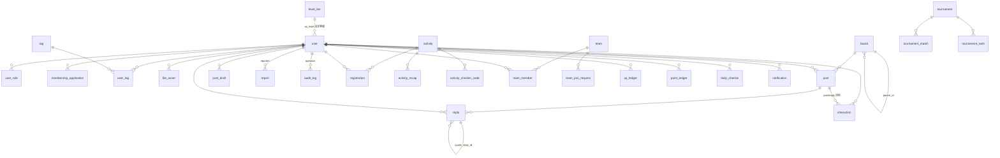

# 吉悠社成员中心 · 数据库设计文档

| 项目 | 内容 |
| --- | --- |
| 版本 | v1.0（2026-10-07） |
| 依据 | SRS v1.1 状态机 4.1–4.9 与数据实体 §5、PRD v1.2 C7（Lv1–20）、冻结原型 41 页字段盘点 |
| 数据库 | MySQL 8.4 · InnoDB · utf8mb4 / utf8mb4_unicode_ci |
| 设计原则 | 三范式为主 · 适度冗余（计数列/快照列，冗余值以流水与事务为唯一事实来源）· 每表预留 `ext_json` 扩展字段 |

## 1. 全局规范

### 1.1 时间字段
- 全部时间列使用 `DATETIME(3)`；统一存储服务器本地时区（Asia/Shanghai，NFR-15 备案属地）；命名 `*_at`；
- 每表必带 `created_at DATETIME(3) NOT NULL DEFAULT CURRENT_TIMESTAMP(3)`、`updated_at DATETIME(3) NOT NULL DEFAULT CURRENT_TIMESTAMP(3) ON UPDATE CURRENT_TIMESTAMP(3)`（下文不再重复列出）。

### 1.2 软删除与状态
- 有业务状态机的实体（帖子/回帖/活动/报名/工单/账号）**不使用通用软删除列**，删除与隐藏是状态机的显式状态（SRS 4.1–4.9）；
- 无状态机的基础数据（敏感词/字典/标签）用 `status ENUM('enabled','disabled')`；
- 账号注销不删行：`user.status='deactivated'` + 匿名化快照列；内容随匿名化处理（NFR-12，P9-05）。

### 1.3 主键与通用列
- 全部 `id BIGINT UNSIGNED AUTO_INCREMENT PRIMARY KEY`；
- 需要预留扩展的表带 `ext_json JSON NULL`（未来迭代字段先入 ext，稳定后再提列，避免频繁 DDL）；
- 冗余计数列（`*_count`）由业务事务同事务维护，账务/互动流水为唯一事实来源，提供重算校验任务。

### 1.4 枚举落地方式
状态枚举以 `VARCHAR(24)` 存储机器码（与 `packages/shared/src/contracts/enums.ts` 一一对应），配合注释列出中文文案；文案→徽章映射在前端。

## 2. 用户与认证域

### 2.1 `user` 用户
| 字段 | 类型 | 说明 |
| --- | --- | --- |
| id | BIGINT PK | |
| email | VARCHAR(254) UNIQUE NOT NULL | 登录凭证；公开接口永不返回（NFR-11） |
| password_hash | VARCHAR(100) NOT NULL | bcrypt/argon2 加盐哈希（NFR-05） |
| nickname | VARCHAR(24) NOT NULL | ≥2 字符；注销后置「已注销成员」 |
| avatar_file_id | BIGINT NULL → file_asset | |
| signature | VARCHAR(200) NULL | 主页自我介绍（编辑页无字数计数；敏感词校验） |
| attendance_visible | TINYINT(1) NOT NULL DEFAULT 1 | 公开出勤开关（Q8-⑰） |
| status | VARCHAR(24) NOT NULL | `pending_activation / active_no_member / normal / muted / banned / deactivation_cooling / deactivated`（状态机 4.1） |
| muted_until | DATETIME(3) NULL | 禁言到期（到期自动回 normal） |
| status_reason | VARCHAR(200) NULL | 禁言/封禁原因摘要（禁言原因枚举：人身攻击/垃圾广告/违规内容/其他） |
| xp_total | INT UNSIGNED NOT NULL DEFAULT 0 | 经验冗余余额（= xp_ledger 汇总，可重算） |
| point_total | INT UNSIGNED NOT NULL DEFAULT 0 | 贡献值冗余余额 |
| makeup_cards | TINYINT NOT NULL DEFAULT 0 | 补签卡持有数（获取方式 P9-24 待确认→遗漏上报 G-1） |
| admin_2fa_passed_at | DATETIME(3) NULL | 后台二次验证通过时点（NFR-07，会话级校验） |
| deactivated_at | DATETIME(3) NULL | 注销申请时间（冷静期起点，默认 30 天 Q8-㉑） |
| anonymized_at | DATETIME(3) NULL | 冷静期满匿名化完成时点（NFR-12） |
| email_verified_at | DATETIME(3) NULL | 激活时间（P9-20：7 天未激活失效释放邮箱） |
| ext_json | JSON NULL | 扩展预留 |

索引：`UNIQUE(email)`、`idx_status(status)`、`idx_nickname(nickname)`（管理搜索昵称/邮箱 → LIKE 前缀 + 全量尾匹配走 idx）；成员管理列表（A4：成员/等级经验/角色/账号状态/注册时间/操作）。

### 2.2 `user_role` 角色叠加（R1：角色不改变账号状态）
| 字段 | 类型 | 说明 |
| --- | --- | --- |
| id BIGINT PK / user_id FK→user | | |
| role | VARCHAR(24) | `moderator / organizer / admin`（成员=无行，游客=未入会） |
| board_id | BIGINT NULL → board | 版主作用域（原型「阿茶（版主，桌游面杀）」；NULL=全域） |
| granted_by → user / created_at | | 授予留痕（R8） |

索引：`UNIQUE(user_id, role, board_id)`、`idx_role_board(role, board_id)`。

### 2.3 `membership_application` 入会申请（状态机 4.2）
| 字段 | 说明 |
| --- | --- |
| id / user_id FK / status | `pending / approved / rejected` |
| gaming_experience | VARCHAR(2500)，30–500 字 |
| self_intro | VARCHAR(2500)，30–500 字 |
| sensitive_hit | TINYINT(1)，命中转人工标记（FR-B5 口径） |
| reviewer_id → user NULL / reject_reason VARCHAR(500) NULL（必填于拒绝）/ reviewed_at | |
| resubmit_after | DATETIME(3) NULL（拒绝后 7 天，参数 `membership.resubmit_days`） |

索引：`idx_user(user_id, created_at)`、`idx_status_created(status, created_at)`（审核列表 待审核5/已通过/已拒绝）。

### 2.4 `tag` / `user_tag` 标签（C2，≤10 个 P9-09）
- `tag`：id, name VARCHAR(30) UNIQUE, type ENUM(`preset`,`custom`), creator_id NULL(自定义), status。预设样例：金铲铲/狼人杀/CS2/主机游戏/卡坦岛/血染钟楼/原神/CS2/永劫无间/阿瓦隆…
- `user_tag`：user_id, tag_id，`UNIQUE(user_id, tag_id)`；自定义标签过敏感词校验（原型「标签命中敏感词，已拒绝」）。

### 2.5 `file_asset` 附件（NFR-03）
id, owner_id → user, scene ENUM(`post_image`,`avatar`,`recap_photo`), original_name, size_bytes (≤10MB), mime (jpg/png/gif/webp), storage_path, status ENUM(`scanning`,`available`,`blocked`), created_at。索引 `idx_owner(owner_id, created_at)`。

## 3. 论坛域

### 3.1 `board` 版块（两级，Q4）
id, parent_id NULL → board（自关联，仅两级：校验父级不得再有父级）, name VARCHAR(30), visibility ENUM(`public`,`members_only`), sort INT（原型 排序 1–6）, description NULL, post_count INT UNSIGNED DEFAULT 0（冗余，A7 列表「X 帖」）。
索引：`idx_parent_sort(parent_id, sort)`。
种子数据（原型）：公告栏(专属,1)→社务公告/活动公示；综合闲聊(2)；游戏分区(3)→原神/金铲铲之战/永劫无间/CS2；桌游面杀(4)；线下活动(5)；求助问答(6)。

### 3.2 `post` 帖子（状态机 4.3）
| 字段 | 说明 |
| --- | --- |
| id / board_id FK / author_id FK | |
| title VARCHAR(100)（≤100 字，P9-06） | |
| content MEDIUMTEXT | 富文本 HTML（TipTap 白名单过滤后存储，NFR-10；≤20000 字） |
| status | `published / pending_review / rejected / hidden / deleted`（先发后审 Q7；编辑重校验 R4） |
| is_pinned / is_featured | 置顶（板内上限 5，参数 `forum.pin_limit`）/ 精华（版主操作条「置顶（5/5）」「加精」） |
| view_count / like_count / favorite_count / reply_count | 冗余计数（原型 浏览 1,204、赞 65、评论 38） |
| last_reply_at DATETIME(3) NULL | 热门/默认排序用 |
| deleted_by → user NULL / deleted_reason VARCHAR(200) NULL | 删除后「该内容已被删除」占位（Q8-㉓，可配置） |
| hidden_by → user NULL / published_at / edited_at | |

索引：`idx_board_status_pub(board_id, status, published_at)`（列表 最新/热门）、`idx_author(author_id, published_at)`（我的发帖 128）、`FULLTEXT ft_search(title, content) WITH PARSER ngram`（B10 搜索覆盖标题+正文+回帖：回帖另建联合查询）、`idx_status_created(status, created_at)`（A5 审核队列）。

### 3.3 `reply` 回帖（状态机 4.3）
id, post_id FK, author_id FK, content VARCHAR(20000)?（**上限待定→遗漏上报 M-15**），floor INT UNSIGNED（板内楼层次序，事务内 `post.reply_count+1`），quote_reply_id NULL → reply（「引用 #1 楼」），status 同帖子枚举，like_count（冗余，原型 21/9/6）。
索引：`UNIQUE(post_id, floor)`、`idx_post_status(post_id, status, floor)`、FULLTEXT ngram(content)（搜索覆盖回帖内容）。

### 3.4 `interaction` 互动（B4：赞/藏合一）
id, user_id FK, target_type ENUM(`post`,`reply`), target_id BIGINT, type ENUM(`like`,`favorite`), created_at。
约束：`UNIQUE(user_id, target_type, target_id, type)`（「同一用户对同一对象仅一次有效点赞」FR-B4）。
索引：`idx_target(target_type, target_id, type)`（计数反查/收藏列表 join）。
收藏列表（M9）：favorite 行 join post，作者已删帖仍展示「该内容已被删除」占位（Q8-㉓）——join 保留、不级联删 interaction。

### 3.5 `post_draft` 草稿（B15，P9-08 ≤20）
id, user_id, board_id NULL, title VARCHAR(100) NULL（无标题显示「（无标题草稿）」）, content MEDIUMTEXT NULL, last_autosave_at DATETIME(3)。
约束：应用层校验数量 ≤20（超限拒绝保存）；索引 `idx_user_saved(user_id, last_autosave_at)`。

### 3.6 `sensitive_word` 敏感词（E10，增删即时生效 Q8-⑭）
id, word VARCHAR(60) UNIQUE, created_by → user, created_at。生效机制：全量载入 AC 自动机缓存（Redis/进程内），写操作发布失效事件。

## 4. 治理域

### 4.1 `report` 举报工单（状态机 4.4）
| 字段 | 说明 |
| --- | --- |
| id / ticket_no VARCHAR(20) UNIQUE | 格式 `JB-YYYYMMDD-NNN`（原型 JB-20261001-014），日序列 |
| reporter_id → user NULL | 支持匿名（A6「举报人：夜风/匿名」） |
| target_type ENUM(`post`,`reply`,`user`) / target_id | |
| target_snapshot VARCHAR(500) | 对象快照（标题/楼层摘要+作者昵称），删除后工单仍可读（「回帖 #3 楼（咸鱼要翻身）」） |
| reason | VARCHAR(30)：`spam / personal_attack / illegal / other`（可配置枚举 → sys_dict_item `report_reason`） |
| detail VARCHAR(500) NULL | 补充说明 |
| status | `pending / processing / resolved_action / resolved_dismiss`（待受理/处理中/已办结-属实/已办结-驳回） |
| handler_id → user NULL / accepted_at / resolved_at | |
| resolution_action NULL | ENUM(`delete_post`,`hide_content`,`mute_user`,`ban_user`,`dismiss`) |
| due_at DATETIME(3) | created_at + 72h（P9-03），超时预警（P9-14） |
| merged_into_id NULL → report | 重复举报合并（P9-07：「本次举报已合并至既有工单」） |

索引：`idx_status_due(status, due_at)`（72h 预警）、`idx_target(target_type, target_id)`、`idx_reporter(reporter_id, created_at)`、`UNIQUE(ticket_no)`。

### 4.2 `audit_log` 审计日志（E11，NFR-14，保留 12 个月可配置 Q8-⑮）
id, operator_id → user NULL（NULL=「系统（自动）」）, operator_name VARCHAR(30)（快照，注销后仍可读）, action VARCHAR(30)：`membership_review / post_delete / post_hide / mute / ban / role_change / param_change / xp_point_gift / reward_grant / data_export`（A10 筛选枚举）, target_type VARCHAR(30), target_id BIGINT NULL, target_desc VARCHAR(200)（「运营参数 · 每日签到经验」「综合闲聊 · 帖子 #T-72164」）, detail VARCHAR(1000)（变更摘要「8 → 10（P9-16 默认值）」）, created_at。
索引：`idx_operator_time(operator_id, created_at)`、`idx_action_time(action, created_at)`、`idx_created(created_at)`（86 页）。
注意：**原型无 IP 列**（上报 D-7）；敏感操作含管理员的导出动作（E8/R8 留痕）。

## 5. 活动域

### 5.1 `activity` 活动（状态机 4.5）
| 字段 | 说明 |
| --- | --- |
| id / organizer_id FK（代创建时 organizer 记管理员+审计 R8） | |
| title VARCHAR(60)（「周六桌游面杀 · 第 15 期」） | |
| type ENUM(`online`,`offline`) | |
| location VARCHAR(200) NULL | 线下必填（线上地址字段缺失→遗漏上报 A-3） |
| fee_text VARCHAR(100) NULL | 费用说明（「AA 制（场地 35 元/人）」——**event-view 结构化展示但表单无字段→遗漏上报 A-2**） |
| max_participants SMALLINT UNSIGNED | ≥2（「人数上限至少 2 人」） |
| start_time / end_time DATETIME(3) | 校验：开始>now、结束>开始 |
| signup_deadline DATETIME(3) NULL | 手动提前截止（P9-21）；NULL=派生 start−2h（Q8-⑦ 参数 `activity.edit_lock_minutes`） |
| description MEDIUMTEXT NULL | 富文本说明（含 AA 制等） |
| status | `signup_open / signup_closed / ongoing / finished / reward_granted / cancelled` |
| cancelled_by → user NULL / cancel_reason VARCHAR(200) NULL | 取消通知全部报名+候补（R6） |
| recap_status | NULL/`draft`/`published`（O4 回顾存草稿/发布） |

索引：`idx_status_start(status, start_time)`、`idx_start(start_time)`（月历 G4）。

### 5.2 `activity_recap` 回顾（D7）
id, activity_id UNIQUE FK, title VARCHAR(100), content MEDIUMTEXT（过敏感词 FR-B5）, status ENUM(`draft`,`published`), published_by → user, published_at。照片走 file_asset（scene=recap_photo）+ `recap_image(recap_id, file_id, sort)`。

### 5.3 `registration` 报名/候补（状态机 4.6，NFR-02 不超卖）
| 字段 | 说明 |
| --- | --- |
| id / activity_id FK / user_id FK | `UNIQUE(activity_id, user_id)`（同人一场一次） |
| type ENUM(`signup`,`waitlist`) | 满员前报名/满员后候补（候补 5 人） |
| queue_no SMALLINT UNSIGNED NULL | 候补位次（#1，顺延依据） |
| status | `signed_up / waitlist_pending / waitlist_expired / cancelled / attended / absent`（原型词：报名/候补 #1·待确认/递补超时·已顺延/已取消/已出席/未出席） |
| confirm_deadline DATETIME(3) NULL | 递补确认截止（12h，Q8-⑧） |
| confirmed_at / cancelled_at | |
| checkin_at DATETIME(3) NULL / checkin_method NULL | ENUM(`qr_scan`,`passcode`,`manual`)（Q8-⑨；幂等：重复扫码提示已签到） |
| reward_granted TINYINT(1) DEFAULT 0 | 幂等标记（P9-18，同活动同成员仅一次） |

索引：`UNIQUE(activity_id, user_id)`、`idx_activity_type_status(activity_id, type, status)`（名单表：类型/成员/时间/状态）、`idx_user_status(user_id, status)`（我的报名 23/19/出席率 82.6%）。
满员判定事务：`SELECT COUNT(*) ... FOR UPDATE`（activity 行锁）→ 未满插入 signup / 已满插入 waitlist(queue_no=MAX+1)；取消触发队首递补并写 confirm_deadline。

### 5.4 `activity_checkin_code` 签到凭证（D5，Q8-⑨）
id, activity_id FK, qr_token VARCHAR(64)（5 分钟轮换）、qr_expires_at DATETIME(3), passcode VARCHAR(12) NULL（**口令码形态未定义→遗漏上报 A-6**）。`UNIQUE(activity_id)`。

## 6. 组队域（状态机 4.7，P9-22 三态+归档）

### 6.1 `team`
id, captain_id → user, game_name VARCHAR(30)（「永劫无间」）, play_time_text VARCHAR(60)（「今晚 21:00」自由文本）, max_size TINYINT（3/4/5）, voice_tool VARCHAR(30) NULL（开黑啦/Discord——**无表单输入来源→遗漏上报 A-4**）, rank_requirement VARCHAR(60) NULL（「陨星以上」——同上）, rules_text VARCHAR(200) NULL（「车规：不摆烂不挂机」——同上）, description VARCHAR(500) NULL, status ENUM(`recruiting`,`full`,`disbanded`,`archived`)（招募中/已满员/已解散/已归档；归档关联活动结束 P9-22）, related_activity_id NULL → activity, disbanded_reason VARCHAR(200) NULL（「队长退出且无受让」P9-11）。
索引：`idx_status_created(status, created_at)`（Tab 全部/招募中/已满员）。

### 6.2 `team_member`
id, team_id FK, user_id FK, is_captain TINYINT(1), rank_text VARCHAR(30) NULL（「陨星·IV」「烛龙·V」「未定级」——**无资料来源→遗漏上报 A-4**）, joined_at。`UNIQUE(team_id, user_id)`；满员自动关闭加入（R7）。

### 6.3 `team_join_request`
id, team_id FK, user_id FK, rank_text NULL, status ENUM(`pending`,`approved`,`rejected`), handled_by → user NULL, handled_at。`UNIQUE(team_id, user_id)`；审批时满员提示失败（R7）。

## 7. 赛事域（D9，P2——结构完整、实现延后）

### 7.1 `tournament`
id, name VARCHAR(60)（「金铲铲社区赛 · S3 赛季」）, format VARCHAR(30)（「32 强双败」）, status ENUM(`signup`,`scheduling`,`ongoing`,`settled`)（4.8：报名中/赛程编排/比赛中/已结算）, start_date DATE, win_points INT DEFAULT 30, participate_points INT DEFAULT 10（运营参数可配置）, settled_at, created_by。

### 7.2 `tournament_match`
id, tournament_id FK, round VARCHAR(20)（轮次）, side_a_user → user, side_b_user → user NULL（「待定」）, score_a TINYINT NULL, score_b TINYINT NULL, status ENUM(`pending`,`a_win`,`b_win`)（待开始/2:1 胜/0:2 负）, played_at。成绩录错 → 管理员修正+积分调整流水冲正（P9-12）。

### 7.3 `tournament_rank`
id, tournament_id FK, user_id FK, wins INT, points INT, rank_no SMALLINT（S2 排行 1–5：+240/+180/…）。`UNIQUE(tournament_id, user_id)`。积分入账写 point_ledger（source=tournament）。

## 8. 账务与等级域（G1–G3，账务模型 4.9）

### 8.1 `xp_ledger` 经验值流水（只增不减）
id, user_id FK, amount INT UNSIGNED（+10/+12/…/+100）, source_type ENUM(`checkin`,`activity_reward`,`admin_gift`,`adjustment`), source_id BIGINT NULL（activity_id/checkin_id/gift 批次）, remark VARCHAR(200) NULL（「管理员赠送 · 中秋活动奖励」）, operator_id → user NULL（管理员），created_at。
幂等：`UNIQUE(source_type, source_id, user_id)`（同活动同成员仅一次 P9-18）。
索引：`idx_user_created(user_id, created_at)`（流水列表/「查看完整账务」）。

### 8.2 `point_ledger` 积分流水
同构（source_type：`tournament`,`activity_reward`,`admin_gift`,`adjustment`），累积为贡献值（不参与等级 N1）。

### 8.3 `daily_checkin` 签到（G1，P9-17）
id, user_id FK, checkin_date DATE, day_no TINYINT（连续第 N 天 1–7，断签重置）, xp_awarded SMALLINT（+10/+12/+14/+16/+18/+20/+30）, is_makeup TINYINT(1) DEFAULT 0, makeup_for_date DATE NULL（补签目标日）。
`UNIQUE(user_id, checkin_date)`（每日一次；补签占用目标日期位）。
口径注：本月已签/累计经验由聚合查询；「连续第 N 天」按自然日连续性计算，断签重置。

### 8.4 `level_tier` 等级档位（G2，v1.2 20 级）
id, level TINYINT UNIQUE (1–20), tier_name VARCHAR(12)（见习/常驻/活跃/元老/传奇，各 4 级）, xp_threshold INT（累计经验 E(n)=50×n×(n−1)，Lv20=19,000）, sort。
运营参数 `rewards.level_tiers`（JSON）后台可改（P9-19 即时重算）；本表为**当前生效快照**，参数修改后重写。等级展示：数字=level，段位名=tier_name。

### 8.5 赠送（G3）无独立表
管理员赠送 = xp_ledger/point_ledger 各一条（source_type=admin_gift）+ audit_log 一条（动作 赠送经验/积分）+ notification 一条；最近赠送记录列表（A11：时间/成员/类型/数量/备注/通知）= 按 source_type=admin_gift 查流水 join 通知。

## 9. 通知域

### 9.1 `notification` 站内通知（F1/F2，B13 聚合）
| 字段 | 说明 |
| --- | --- |
| id / user_id FK | |
| type | `reply_at`(回复与@) / `like`(点赞) / `review_signup`(审核与报名) / `xp_point`(经验/积分) / `system`(公告)——Tab 四类+全部 |
| title VARCHAR(100)（「管理员向你赠送了 100 经验值」） | |
| content VARCHAR(500) NULL | 副文案（「当前等级 Lv4 · 距 Lv5 还差 136 经验」=**发送时点快照**，不随后续等级变化——上报 M-3 已按快照口径设计） |
| link_url VARCHAR(200) NULL | 整行跳转（/member/checkin 等） |
| agg_key VARCHAR(120) NULL | 聚合键（`reply:post:123`，1h 窗口 Q8-⑥），agg_count INT（「等 5 人」） |
| is_read / read_at | 全部标为已读（批量 UPDATE） |
| emailed_at DATETIME(3) NULL | 邮件同步发送标记（F2/P9-15，安全类邮件不受订阅开关限制） |

索引：`idx_user_read_created(user_id, is_read, created_at)`、`idx_user_type(user_id, type, created_at)`（Tab 计数）。

## 10. 系统域

### 10.1 `sys_param` 运营参数（R9/E10，22 项，附录 10.2 全集）
param_key VARCHAR(60) PK, param_value VARCHAR(500) NOT NULL, default_value VARCHAR(500), remark VARCHAR(200), updated_by → user, updated_at（修改写 audit_log「参数修改」，如「8 → 10（P9-16 默认值）」）。
键清单（含原型集中表 11 项 + 原型未收录的 SRS 可配置项，**后者已上报 A-5**）：`membership.resubmit_days=7`、`checkin.xp_base=10`、`checkin.progression=[10,12,14,16,18,20,30]`、`checkin.makeup_rule=undefined(P9-24 待定)`、`activity.reward_xp=50`、`activity.reward_points=20`、`rewards.gift_limit=1000`、`rewards.level_tiers=<20级JSON>`、`moderation.review_sla_hours=72`、`auth.lock_threshold=5`、`auth.lock_minutes=15`、`audit.retention_months=12`、`account.cooling_days=30`、`post.title_max=100`、`post.content_max=20000`、`forum.draft_limit=20`、`user.tag_limit=10`、`notify.email_enabled=true(P9-15)`、`auth.email_code_minutes=10(P9-23)`、`auth.email_code_resend_seconds=60`、`activity.edit_lock_minutes=120`、`registration.confirm_hours=12`、`notify.activity_remind_hours=[24,1]`、`forum.pin_limit=5`、`notify.agg_window_minutes=60`。

### 10.2 `sys_dict_item` 可配置枚举
id, dict_type VARCHAR(30)（`report_reason`：垃圾广告/人身攻击/违规内容/其他；`mute_reason`：人身攻击/垃圾广告/违规内容/其他）, label VARCHAR(30), sort, status。举报理由 radio（M15）与禁言原因下拉（A4）均读此表。

## 11. 实体关系总览（外键汇总）

## 12. 设计决策与原型差异记录

| 决策 | 说明 |
| --- | --- |
| 冗余计数列 | post.like/favorite/reply/view、board.post_count、user.xp_total/point_total——查询性能（NFR-01），流水/事务为事实来源，提供重算任务 |
| target_snapshot 快照列 | report；处置对象删除后工单仍自读（原型「帖子（低价代练广告，已拦截转审）」） |
| 状态枚举机读码 | 与 `packages/shared/src/contracts/enums.ts` 一一对应，前端按码渲染徽章 |
| 原型遗漏项 | 全部汇总至《原型与需求遗漏上报.md》，**未私自加字段**；费用说明、组队语音/段位/车规、公告内容、口令码形态等字段已按原型展示侧需求预留列，标注待需求方确认 |
