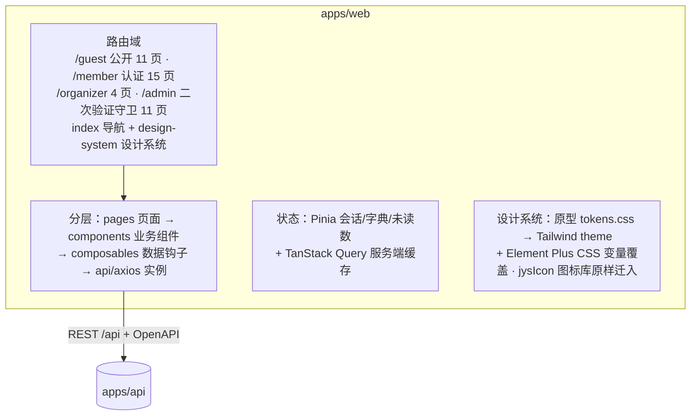
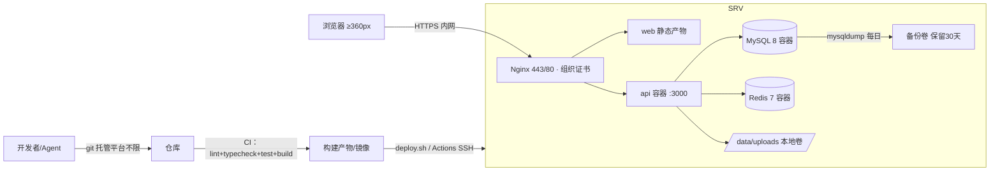

# 吉悠社成员中心 · 项目架构设计文档

| 项目 | 内容 |
| --- | --- |
| 版本 | v1.0（2026-10-07 评审通过，技术选型经需求方逐项确认） |
| 设计依据 | PRD v1.2（53 条功能 + C6–C8 等级经验 + 范围外 X1–X6）· SRS v1.1（FR-A1～G3 / NFR-01～15 / P9 决议）· 冻结原型 v1.1（41 页，2026-10-07 冻结） |
| 设计原则 | 模块化单体（modular monolith）· 满足 NFR 上限（成员 ≤5000 / 峰值在线 ≤500 / 接口 P95 ≤500ms）· 禁止过度设计，保持极简稳定 |
| 部署形态 | **本地部署**（需求方确认）：组织自有服务器 + Docker Compose，不依赖公有云 |

## 一、技术选型决策记录（已确认 ✅）

| # | 决策项 | 选定 | 备选与落选理由 | 状态 |
| --- | --- | --- | --- | --- |
| 1 | 前端框架 | **Vue 3.5 + Vite + TypeScript + Element Plus** | React 18 + AntD（生态大但暖橙主题定制成本高）；Nuxt 3 SSR（PRD 无 SEO 硬需求，引流靠微信群，运维负债）。配套：Pinia + TanStack Query(Vue) + Tailwind + ECharts + TipTap（富文本，白名单过滤满足 NFR-10） | ✅ 已确认 |
| 2 | 移动端方案 | **响应式 H5（同一 SPA，≥360px，P9-02）** | PRD X2 锁定"仅 Web 响应式适配移动端浏览器，不做原生 App"；小程序/uni-app 属范围外，若 P2 立项以独立仓库实施 | ✅ 已确认 |
| 3 | 后端语言与框架 | **NestJS 10 + TypeScript + Prisma** | Spring Boot 3（企业标杆但双语言栈，小团队成本翻倍，接口契约不变可整体替换）；Go/FastAPI（生态或工程结构弱）。API 风格：REST + OpenAPI 自动文档，不用 GraphQL | ✅ 已确认 |
| 4 | 数据库与搜索 | **MySQL 8（InnoDB / utf8mb4）+ FULLTEXT ngram** | PostgreSQL 16（记为可替换项）；搜索演进触发条件：P95 超 500ms 或需聚合分析 → 引入 MeiliSearch（不用 ES，过度设计） | ✅ 已确认 |
| 5 | 缓存 | **Redis 7 单实例**（AOF） | 验证码/登录锁定（NFR-06）/敏感词与参数缓存（R9）/热帖 TTL/定时任务分布式锁。**边界：报名满员一致性以 MySQL 事务+唯一约束为准（NFR-02 不超卖），Redis 仅读加速** | ✅ 已确认 |
| 6 | 部署环境 | **本地部署：组织自有服务器 + Docker Compose** | K8s（纯运维负债）；公有云（需求方选择本地）。容器编排：nginx / web 静态 / api / mysql / redis | ✅ 已确认（2026-10-07 需求方改定） |
| 7 | 仓库结构 | **pnpm Monorepo**：apps/web + apps/api + packages/shared | 双仓库（类型同步靠发包，多 Agent 改契约不友好） | ✅ 已确认 |
| 8 | 分支策略 | **简化 trunk-based + 模块目录所有权**（详见 §5） | git-flow（流程重）；fork 隔离（同步成本高） | ✅ 已确认 |

**本地部署连带调整**（相对公有云方案的差异，已内化到各节）：
- 对象存储 → **本地磁盘卷**（`/data/uploads`，Nginx 直接服务静态文件）；存储接口抽象保留，未来可平滑切换 MinIO（自托管 S3）或公有 OSS；
- 邮件 → **SMTP 配置化**（组织自有邮箱服务器/企业邮箱，host/port/凭据走环境变量与运营参数），验证码邮件通道不变；
- 备份 → mysqldump 每日全备 + binlog 至本地/网络备份卷，保留 30 天，季度恢复演练；
- HTTPS（NFR-08）→ 组织内 CA 证书或自签证书（域名由组织提供）；若纯内网 HTTP 部署，属 NFR-08 偏差，须需求方书面确认；
- 代码托管平台不限（GitHub / Gitee / 内网 GitLab），§5 分支策略与平台无关；CI 用平台 Actions，无平台则本地 `deploy.sh` 等价执行。

## 二、整体架构

### 2.1 前端架构（apps/web · Vue 3 SPA，路由域对齐冻结原型 41 页）



- 页面与冻结原型一一对应（G1–G11 / M1–M15 / O1–O4 / A1–A11），路由路径即原型路径语义；状态演示切换器（data-when）不迁移，由后端真实状态替代；
- 设计令牌零浪费迁移：`--jys-*` 变量、jys-icon 彩色 SVG、按钮四级层级、等级段位框组件全部作为全局设计系统层。

### 2.2 移动端架构（同一 SPA，无独立工程）

PRD X2 范围内仅为响应式 Web。差异收敛于两层：① Tailwind 断点样式层（`md` 768 / `lg` 1024，最小 360px）：桌面侧栏在移动端折叠为底部 Tab（首页/论坛/活动/我的），数据表格转卡片列表；② 触控与资源规范（§4.6）。API 零改动，未来小程序可复用同一 REST 契约（Token 无状态，不依赖 Cookie）。

### 2.3 后端架构（apps/api · NestJS 模块化单体）

```mermaid
flowchart TB
  G[全局管道：RequestId → JwtGuard → RolesGuard → Throttle/验证码 → 校验管道 → 统一异常过滤器]
  subgraph M[业务模块]
    A[auth<br/>A1-A3/A7] --- U[user<br/>A6/C2] --- MB[membership<br/>A4/E1]
    F[forum<br/>B1-B15] --- MD[moderation<br/>B5/B6/E3/E5/E6/E11]
    AC[activity<br/>D1-D7] --- T[team D8] --- TO[tournament D9·P2 占位]
    RW[rewards<br/>G1-G3+账务4.9] --- N[notification F1]
    AN[analytics E9] --- ST[settings E10/R9]
  end
  C[common：存储抽象 · SMTP · 图形验证码 · 定时任务 · AC敏感词 · 装饰器]
  M --> G
  M -->|Prisma| DB[(MySQL 8)]
  M -->|缓存/锁/验证码| R[(Redis 7)]
  C -->|本地磁盘卷| FS[/data/uploads]
  C -->|SMTP 配置化| MAIL[组织邮件服务器]
```

- **依赖方向**：业务模块 → common（禁止反向）；跨模块取数走对方导出的 Service 接口，禁止直查他模块的表——模块边界即未来拆分边界；
- **通信**：同步 = REST；异步 = EventEmitter2 进程内领域事件（发帖→敏感词审查→通知；活动结束→批量奖励→账务→等级重算→通知；审核通过→角色变更→通知）；定时 = @nestjs/schedule + Redis 锁（活动结算、举报 72h 超时标记、注销冷静期清理）；
- **并发红线**（NFR-02）：活动开放报名瞬间的满员判定以 MySQL 事务 + `UNIQUE(activity, user)` + 条件更新保证不超卖，Redis 只做读加速。

### 2.4 部署架构（本地部署）



- 环境：`dev`（本地 compose，仅 mysql+redis+热重载）/ `prod`（服务器 compose 全栈）；不设 staging（极简）；
- 交付物：`docker-compose.yml`（全栈）、`docker-compose.dev.yml`（开发依赖）、`deploy.sh`（拉取/构建 → Prisma migrate → 健康检查 → 切流）；
- 监控：容器 healthcheck + pino 日志 + 磁盘/进程脚本巡检；Sentry 等外部 APM 列为 P2。

## 三、模块清单与目录树

| 模块 | 职责（SRS 映射） | 依赖 | 通信 |
| --- | --- | --- | --- |
| auth | 注册/邮箱验证码/登录锁定/图形验证码/2FA/找回（A1–A3、NFR-06/07） | common | REST；事件：注销启动 |
| user | 资料/头像/标签/出勤可见开关（A6、C2/C3） | auth、common | REST |
| membership | 入会申请与审核（A4、E1） | user、notification | 事件：审核通过→通知+角色变更 |
| forum | 版块/帖子/回帖/点赞收藏/@提及/草稿/搜索（B1–B15） | moderation、notification、common | 事件：敏感词命中→转审核 |
| moderation | 敏感词库/举报工单/禁言封禁/帖子处置/审计（B5/B6/E3/E5/E6/E11） | forum、user | 事件：处置→通知 |
| activity | 活动/报名/候补/核销/回顾（D1–D7） | user、rewards、notification | 事件：活动结束→批量奖励 |
| team / tournament | 组队（D8）/ 赛事（D9，P2 占位） | user | REST |
| rewards | 签到/等级 Lv1–20/赠送/账务流水（G1–G3、4.9） | user、notification | 事件：经验入账→等级重算→通知 |
| notification | 站内通知聚合/已读/未读数（F1） | 只消费事件 | REST + 30s 轮询（预留 SSE） |
| analytics | 数据看板（E9） | 各模块只读统计接口 | REST |
| settings | 系统配置/敏感词库/运营参数（E10、R9） | common | REST；变更→缓存失效事件 |
| common | 存储抽象/SMTP/图形验证码/定时任务/守卫/AC 敏感词 | 无（被依赖） | — |

```
repo/
├─ apps/
│  ├─ web/            # Vue3 SPA（src/{pages,components,composables,api,stores,design-system}）
│  └─ api/            # NestJS（src/modules/{auth,user,...} + src/common）
├─ packages/shared/   # DTO 类型 · 错误码表 · 角色枚举（前后端唯一来源，主控独占）
├─ docker-compose.yml / docker-compose.dev.yml / deploy.sh
└─ .github/workflows/ci.yml（或等价本地 CI）
```

## 四、全局技术规范

1. **状态管理**：Pinia 仅存会话（Token/角色/禁言态）、字典（版块树/运营参数）、未读数；一切服务端数据走 TanStack Query（staleTime：列表 30s / 详情 60s / 会话 0）。禁止将接口数据复制进 Pinia。
2. **缓存策略**：三层——静态资源 contenthash + Nginx `immutable`；Redis（参数与敏感词库写时失效、热帖 60s、验证码/计数器）；vue-query 客户端缓存。写操作主动失效对应 key，禁止以长 TTL 兜底一致性。
3. **权限体系**：RBAC 五角色（游客/成员/版主/组织者/管理员，对齐 SRS 2.3 矩阵）+ 资源所有权 + 版主版块作用域。服务端逐接口 `RolesGuard` + Service 资源级校验（NFR-09），前端路由守卫仅展示控制；专属版块内容在查询层强制过滤；发帖/回帖前置校验禁言与封禁状态；admin 路由前置 2FA 中间件（NFR-07）。
4. **错误处理**：错误码分段（`AUTH-` / `FORUM-` / `ACT-` / `NET-` / `SYS-`，延续原型 NET-1004 风格），全局 ExceptionFilter 输出 `{code, message, requestId}`；前端拦截器：401→登录页带 redirect、403→无权页、业务码→码表 toast、网络错误自动重试一次；Vue 全局 onErrorCaptured + 错误页。
5. **日志规范**：pino JSON 结构化，requestId 从 Nginx 贯穿至 SQL 注释；访问/应用日志分离、保留 30 天；**审计日志入 MySQL（E11，≥1 年）**；邮箱脱敏、密码/验证码/Token 永不落日志（NFR-11）。
6. **跨端适配**：断点 md 768 / lg 1024、最小 360px（P9-02）；移动端：侧栏→底部 Tab、表格→卡片、触控目标 ≥44px、OSS…本地图片按断点裁剪、懒加载；桌面组件在移动断点统一经响应式封装容器替换，禁止散落判断。

## 五、git 分支策略与多 Agent 协作

**分支模型（简化 trunk-based）**：`main`（保护：PR + CI 四绿 + ≥1 approve，始终可发布）← `feat/*` 短分支；`hotfix/*` 直出 main 并打 tag；版本以 `v*.*.*` tag 标记；不设 develop/release 长分支。

**多 Agent 并行规则**：
1. **目录所有权制**：Agent 按模块认领（`apps/api/src/modules/<mod>` + `apps/web/src/pages/<area>`），只允许改自己目录与自己的路由/菜单注册点；越界 PR 主控直接打回；
2. **共享区主控独占**：`packages/shared`、DB 迁移文件（主控顺序编号）、主题令牌、根配置；其他 Agent 需要新契约 → 先提"契约变更 PR"（仅 shared 类型与迁移），合并后才能继续业务实现；
3. **分支纪律**：命名 `feat/<module>-<topic>`；每 Agent 同时仅 1 个 open PR；从最新 main 切出、合并前 rebase；禁止 force-push main；
4. **合并与冲突责任**：冲突由 PR 作者解决、主控复核；合并顺序主控串行化（同模块串行、跨模块并行）；
5. **CI 门槛**：lint + typecheck + test + build 四绿；每晚 Playwright 冒烟走查原型主链路 16 站；提交遵循 Conventional Commits，PR 描述映射 SRS 编号（如 `FR-B2/B9`）。

## 六、演进路径（按触发条件，不预建）

| 触发条件 | 演进动作 |
| --- | --- |
| 全文搜索 P95 > 500ms / 需聚合分析 | 引入 MeiliSearch（同步 forum 模块写时索引） |
| 通知要求实时 | 未读数轮询 → SSE |
| 存储容量/多机部署 | 本地磁盘卷 → MinIO（S3 兼容，存储抽象已预留） |
| 小程序立项（P2） | 独立仓库 uni-app，复用 REST 契约 |
| 团队扩为 Java 背景 | 后端整体替换 Spring Boot（契约不变） |
| 数据库替换评估 | Prisma 层隔离，MySQL → PostgreSQL 可控 |
